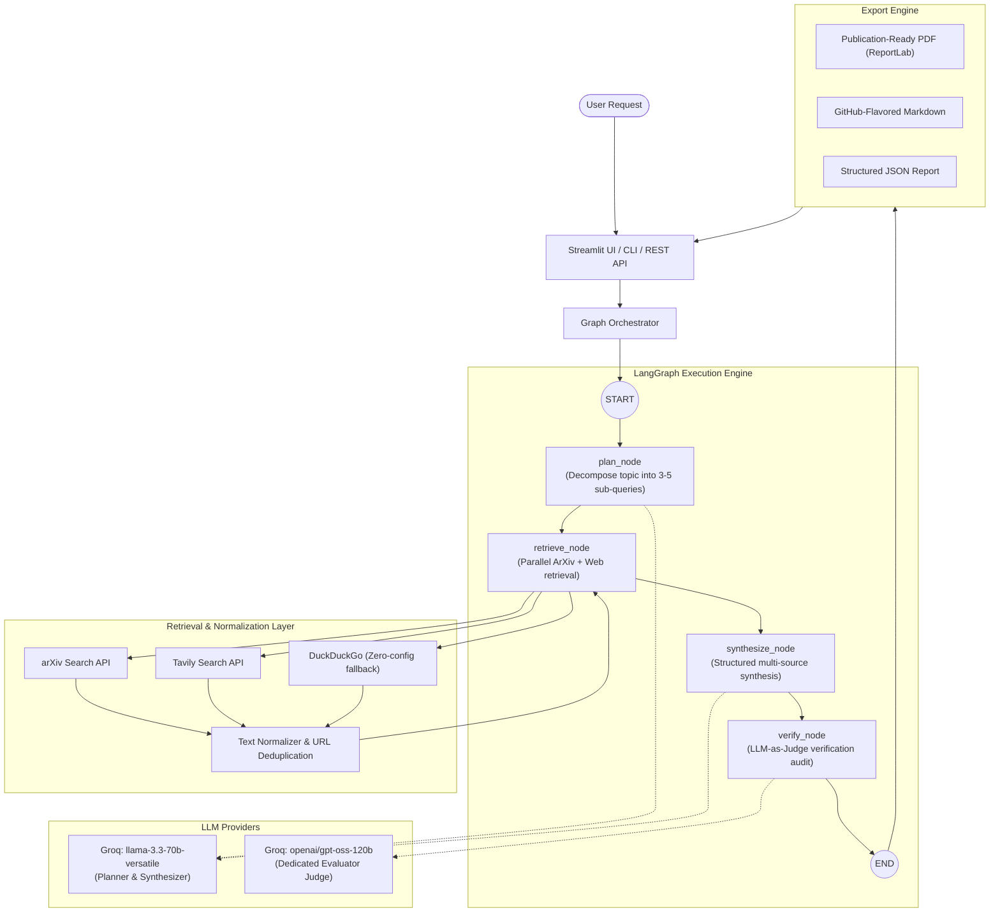

# 🏗️ AI Research Assistant — System Architecture

This document provides a token-efficient, comprehensive architectural blueprint of the AI Research Assistant. It details the runtime lifecycle, LangGraph state machine, data contracts, and integration layers.

---

## 1. High-Level System Architecture



---

## 2. LangGraph State Machine & Data Flow

The research pipeline is implemented as a deterministic `StateGraph` compiled in [`src/graphs/graph.py`](file:///src/graphs/graph.py).

### State Schema: `ResearchGraphState`
Defined in [`src/graphs/state.py`](file:///src/graphs/state.py):

| Field | Type | Description |
| :--- | :--- | :--- |
| `topic` | `str` | Target research topic provided by user. |
| `max_papers` | `int` | Maximum arXiv papers to retrieve per academic sub-query. |
| `max_web_results` | `int` | Maximum web pages to retrieve per general sub-query. |
| `query_plan` | `QueryPlan \| None` | Generated sub-queries and channel assignments (`arxiv`, `web`, `both`). |
| `sources` | `list[ResearchSource]` | Normalized and deduplicated external research material. |
| `synthesis` | `SynthesisReport \| None` | Sectioned synthesis with numbered source citations. |
| `verification` | `VerificationResult \| None` | Faithfulness score (0-100), citation checks, and categorized critique. |
| `status` | `str` | Current workflow phase (`idle`, `planning`, `retrieving`, `synthesizing`, `verifying`, `completed`, `failed`). |
| `error` | `str \| None` | Diagnostic error message if any node fails. |

### Node Lifecycle

1. **`plan_node`**:
   - Calls `src/chains/planner.py` using `ChatPromptTemplate` from `src/prompts/planner.py`.
   - Uses structured output via `.with_structured_output(QueryPlan)`.
   - Generates 3–5 targeted sub-questions with focused search keywords.

2. **`retrieve_node`**:
   - Iterates through `query_plan.queries`.
   - Routes academic queries to `arxiv_tool.py` and web queries to `web_search_tool.py` (Tavily with DuckDuckGo fallback).
   - Normalizes text and deduplicates documents by URL/title using `text_cleaner.py`.

3. **`synthesize_node`**:
   - Calls `src/chains/synthesizer.py`.
   - Synthesizes findings across 6 structural dimensions: *Key Findings*, *Technical Approaches*, *Consensus & Controversies*, *Research Gaps*, *Practical Applications*, *Future Directions*.
   - Strictly enforces index citations (`[0]`, `[1]`, `[2]`).

4. **`verify_node` (LLM-as-Judge)**:
   - Evaluates the draft report against raw retrieved sources.
   - Evaluates faithfulness, citation accuracy, coverage, and clarity.
   - Computes 0–100 composite score and categorizes any identified hallucinations or unsupported claims.

---

## 3. Modular Codebase Boundaries

```text
src/
├── prompts/     # Versioned, standalone ChatPromptTemplates (Zero business logic)
├── chains/      # Composable LCEL runnables binding prompts + LLM + Pydantic schemas
├── graphs/      # State machine definition, state models, and node runners
├── tools/       # Low-level external integration (arXiv, Tavily, DDG, text cleaners)
├── models/      # Universal Pydantic data contracts (QueryPlan, ResearchSource, etc.)
├── utils/       # Cross-cutting concerns: exporter.py, logger.py
├── agents/      # Backward-compatible facades delegating to chains and graphs
└── server/      # HTTP/REST API endpoints (FastAPI)
```

---

## 4. Multi-Tier Model Strategy

To maximize reasoning quality while optimizing cost and speed:

| Role | Environment Variable | Default Model | Specs & Reason |
| :--- | :--- | :--- | :--- |
| **Planner & Synthesizer** | `GROQ_MODEL` | `llama-3.3-70b-versatile` | Ultra-fast token throughput (~300 tok/s), strong structural schema adherence. |
| **Verification Judge** | `VERIFIER_MODEL` | `openai/gpt-oss-120b` | 120B MoE model with 131K context window. Separated model prevents self-bias and provides rigorous self-critique. |

---

## 5. Roadmap Architecture Extensions (Phases 4–7)

- **Phase 4 (Gateway, Memory, Evaluation)**:
  - **TensorZero-style Gateway**: GPT-4o primary with circuit-breaker fallback to Groq.
  - **Redis STM**: In-memory session buffer for conversational research iterations.
  - **pgvector LTM**: Persistent PostgreSQL embeddings for cross-session knowledge reuse.
  - **Semantic Cache**: Cosine similarity cache to bypass redundant web searches.
- **Phase 5 (Visual LLM)**:
  - Multi-modal VLM parsing diagrams and figures from source PDFs, verifying numeric claims.
- **Phase 6 (Security & Red Teaming)**:
  - AWS Bedrock Guardrails + PyRIT automated red-teaming test harnesses.
- **Phase 7 (Production Deployment)**:
  - Docker containerization, AWS ECS Fargate, ALB, Terraform IaC, and GitHub Actions CI/CD.
