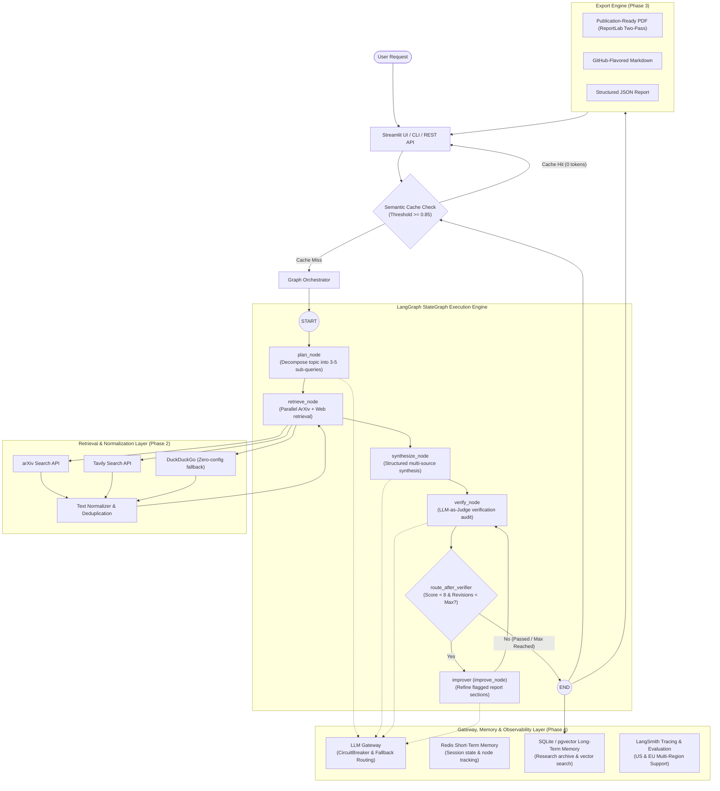

# 🏗️ AI Research Assistant — System Architecture

This document provides a comprehensive, token-efficient architectural blueprint of the AI Research Assistant. It details the runtime lifecycle, LangGraph state machine, data contracts, gateway/memory layers, and integration boundaries.

---

## 1. High-Level System Architecture



---

## 2. LangGraph State Machine & Closed-Loop Refinement

The research pipeline is implemented as a deterministic `StateGraph` compiled in [`src/graphs/graph.py`](file:///src/graphs/graph.py).

### State Schema: `ResearchGraphState`
Defined in [`src/graphs/state.py`](file:///src/graphs/state.py):

| Field | Type | Description |
| :--- | :--- | :--- |
| `query` | `str` | Target research topic provided by the user. |
| `max_papers` | `int` | Maximum arXiv papers to retrieve per academic sub-query. |
| `max_web` | `int` | Maximum web pages to retrieve per general sub-query. |
| `max_revisions` | `int` | Maximum permitted self-refinement iterations (default: 2). |
| `revision_count` | `int` | Current number of refinement passes executed. |
| `session_id` | `str` | Unique session identifier for Redis STM tracking. |
| `is_cache_hit` | `bool` | Whether the result was served from the Semantic Cache. |
| `plan` | `QueryPlan \| None` | Generated sub-queries and channel assignments (`arxiv`, `web`, `both`). |
| `sources` | `list[ResearchSource]` | Normalized and deduplicated external research material. |
| `synthesis` | `list[SynthesisSection]` | Sectioned synthesis with numbered source citations. |
| `verification` | `VerificationResult \| None` | Faithfulness score (0–10), citation checks, and categorized critique. |
| `status` | `str` | Current workflow phase (`planning`, `retrieving`, `synthesizing`, `verifying`, `improving`, `complete`). |
| `errors` | `list[str]` | Diagnostic error messages captured during execution. |

### Node Lifecycle & Execution Flow

1. **`plan_node`**:
   - Invokes `src/chains/planner.py` with `planner_prompt` from `src/prompts/planner.py`.
   - Uses structured output via `.with_structured_output(QueryPlan)`.
   - Decomposes the research topic into 3–5 targeted sub-questions with search keyword formulation.

2. **`retrieve_node`**:
   - Concurrently executes queries across channels (`arxiv`, `web`, `both`).
   - Integrates arXiv API (`src/tools/arxiv_tool.py`) and Tavily/DuckDuckGo (`src/tools/web_search_tool.py`).
   - Normalizes text and deduplicates documents by URL/title using `src/tools/text_cleaner.py`.

3. **`synthesize_node`**:
   - Invokes `src/chains/synthesizer.py`.
   - Synthesizes findings across 6 structural dimensions: *Key Findings*, *Technical Approaches*, *Consensus & Controversies*, *Research Gaps*, *Practical Applications*, *Future Directions*.
   - Strictly enforces 0-based index citations (`[0]`, `[1]`, `[2]`).

4. **`verify_node` (LLM-as-Judge)**:
   - Evaluates the draft report against raw retrieved sources using `src/chains/verifier.py`.
   - Uses a dedicated, high-capacity evaluator model (`openai/gpt-oss-120b`).
   - Computes overall score (0–10), approval status (`is_approved`), and categorizes issues (`hallucination`, `unsupported_claim`, `broken_citation`, `missing_evidence`, `clarity_issue`).

5. **`route_after_verifier` (Conditional Edge)**:
   - If `verification.overall_score < 8` and `revision_count < max_revisions`: routes to `improver`.
   - Else: routes to `END`.

6. **`improver` (`improve_node`)**:
   - Invokes `src/chains/refiner.py` with `refiner_prompt` from `src/prompts/refiner.py`.
   - Specifically rewrites sections flagged by the judge to address feedback and unsupported claims.
   - Increments `revision_count` and routes back to `verify_node` for re-evaluation.

---

## 3. Gateway, Memory & Caching Architecture (Phase 4)

### 3.1 LLM Gateway (`src/chains/gateway.py`)
- **Resilient Fallback**: Automatically routes requests from primary model (`GROQ_MODEL`) to fallback model (`FALLBACK_MODEL`, default: `llama-3.1-8b-instant`) on failures.
- **Circuit Breaker**: Tracks consecutive failures per provider. Automatically trips to OPEN state after 3 failures, preventing cascading timeouts with a configurable cooldown period (60s).
- **Exponential Backoff**: Built-in retries for transient HTTP errors and rate limits.

### 3.2 Layered Memory Hierarchy
- **Short-Term Memory (STM — `src/memory/stm.py`)**:
  - Redis-backed in-memory store for active session states and node transition auditing.
  - Automatic TTL expiration (default: 3600s).
  - Graceful, zero-configuration in-memory dictionary fallback when Redis is unavailable.
- **Long-Term Memory (LTM — `src/memory/ltm.py`)**:
  - Persistent SQLite / PostgreSQL + `pgvector` store archiving full research runs, synthesis reports, retrieved sources, and verification scores.
  - Enables historical research retrieval and cross-session knowledge continuity.

### 3.3 Semantic Caching (`src/memory/semantic_cache.py`)
- **Zero-Token Short-Circuit**: Calculates lexical token overlap and sequence similarity between incoming queries and cached runs.
- **Similarity Threshold**: Bypasses the entire LLM pipeline when query similarity is $\ge 0.85$, serving instant results with `is_cache_hit = True`.

### 3.4 Observability & Multi-Region LangSmith (`config/settings.py`)
- **Pre-Flight Health Check**: Automatically pings the configured LangSmith endpoint on startup.
- **Multi-Region Support**: Full compatibility with both US (`https://api.smith.langchain.com`) and EU (`https://eu.api.smith.langchain.com`) data centers, plus organization workspaces via `LANGCHAIN_WORKSPACE_ID`.
- **Error Suppression**: Proactively disables tracing if credentials or endpoints fail, preventing Streamlit log spam.

---

## 4. Multi-Tier Model Strategy

| Role | Environment Variable | Default Model | Specs & Rationale |
| :--- | :--- | :--- | :--- |
| **Planner & Synthesizer** | `GROQ_MODEL` | `llama-3.3-70b-versatile` | High throughput (~300 tok/s), strong structural schema adherence. |
| **Verification Judge** | `VERIFIER_MODEL` | `openai/gpt-oss-120b` | 120B MoE model with 131K context window. Independent model prevents self-bias. |
| **Gateway Fallback** | `FALLBACK_MODEL` | `llama-3.1-8b-instant` | Ultra-fast lightweight model ensuring 100% uptime during provider outages. |

---

## 5. Modular Codebase Boundaries

```text
src/
├── prompts/     # Versioned, standalone ChatPromptTemplates (Zero business logic)
│   ├── planner.py
│   ├── synthesizer.py
│   ├── verifier.py
│   └── refiner.py
├── chains/      # Composable LCEL runnables binding prompts + LLM + Pydantic schemas
│   ├── llm.py
│   ├── gateway.py
│   ├── planner.py
│   ├── synthesizer.py
│   ├── verifier.py
│   └── refiner.py
├── graphs/      # LangGraph StateGraph assembly, nodes, and conditional routers
│   ├── state.py
│   ├── nodes.py
│   └── graph.py
├── memory/      # Layered memory & caching subsystem
│   ├── stm.py
│   ├── ltm.py
│   └── semantic_cache.py
├── tools/       # Low-level external integrations (arXiv, Tavily, DDG, text cleaning)
├── models/      # Universal Pydantic data contracts (QueryPlan, SynthesisSection, etc.)
├── utils/       # Cross-cutting concerns: ReportLab exporter.py, logger.py
├── agents/      # Backward-compatible facades delegating to chains and graphs
└── server/      # HTTP/REST API endpoints (FastAPI — Phase 7)
```

---

## 6. Roadmap Architecture Extensions (Phases 5–7)

- **Phase 5 (Visual LLM Extension)**:
  - Multi-modal VLM (GPT-4o Vision / Qwen-VL) parsing diagrams, tables, and figures from source PDFs.
  - Multi-modal faithfulness scoring cross-checking written numerical claims against source figures.
- **Phase 6 (Security & Red Teaming)**:
  - AWS Bedrock Guardrails for input/output sanitization and rate limiting.
  - Automated PyRIT red-team dashboard testing prompt injection, XPIA, crescendo, and image-based attacks.
- **Phase 7 (Production Infrastructure & API)**:
  - FastAPI REST API with asynchronous research job queues and report download endpoints.
  - Terraform AWS IaC (ECS Fargate, RDS PostgreSQL/pgvector, ElastiCache Redis, ALB, ECR).
  - GitHub Actions CI/CD with automated testing, deployment, and blue-green rollback.
