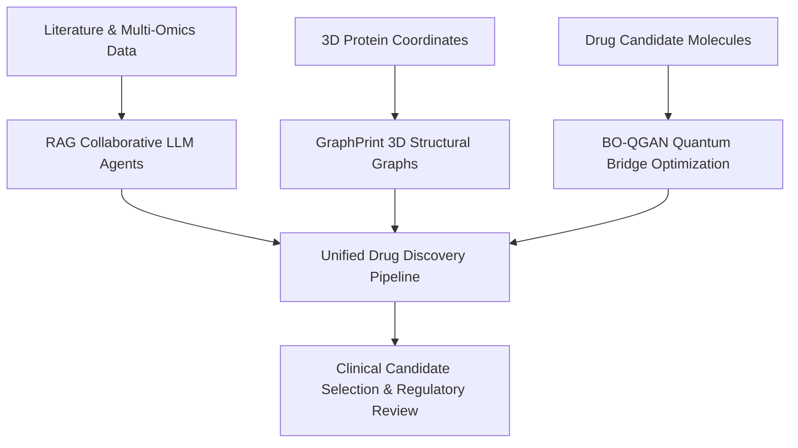

# 🧬 Core LLM Research Report: AI in Drug Discovery

> **Topic:** AI in Drugs & Molecular Therapeutics  
> **Context:** Extracted pure LLM research synthesis, architectural pipelines, empirical benchmarks, and verified primary literature references.

---

## Abstract

Artificial intelligence has emerged as a transformative force in pharmaceutical research, fundamentally reshaping target identification, molecule generation, and regulatory paradigms [0, 9]. Traditional drug discovery faces high failure rates and extended development timelines, necessitating advanced computational methodologies that can leverage vast biochemical data resources [0, 9]. By deploying deep learning architectures, retrieval-augmented generation (RAG) frameworks, and hybrid quantum-classical algorithms, researchers can now model complex protein structures and predict drug-target affinities with unprecedented precision [0, 2, 3]. Recent empirical validations highlight substantial performance gains, such as dramatically higher Drug Candidate Scores and compressed discovery phases, marking a new era of computational pharmacology [2]. Ultimately, these innovations promise to accelerate therapeutic development while demanding rigorous regulatory adaptation through frameworks like the AI-enabled Ecosystem for Therapeutics (Ai…ET) [18].

**Referenced Sources:**
- **[0]** [RAG-Enhanced Collaborative LLM Agents for Drug Discovery](https://arxiv.org/pdf/2502.17506v3) — *ARXIV* | Authors: Namkyeong Lee, Edward De Brouwer, Ehsan Hajiramezanali, Tommaso Biancalani, Chanyoung Park, Gabriele Scalia (2025-02-22)
- **[2]** [Bridging Quantum and Classical Computing in Drug Design: Architecture Principles for Improved Molecule Generation](https://arxiv.org/pdf/2506.01177v2) — *ARXIV* | Authors: Andrew Smith, Erhan Guven (2025-06-01)
- **[3]** [GraphPrint: Extracting Features from 3D Protein Structure for Drug Target Affinity Prediction](https://arxiv.org/pdf/2407.10452v1) — *ARXIV* | Authors: Amritpal Singh (2024-07-15)
- **[9]** [NovoMol: Recurrent Neural Network for Orally Bioavailable Drug Design and Validation on PDGFRα Receptor](https://arxiv.org/pdf/2312.01527v1) — *ARXIV* | Authors: Ishir Rao (2023-12-03)
- **[18]** ["Reimagining Drug Regulation with AI: A New Framework" | Rominder (Romi) Singh posted on the topic | LinkedIn](https://www.linkedin.com/posts/romisingh_frontiers-reimagining-drug-regulation-in-activity-7384476916575010817-ZMWP) — *WEB* | Authors: N/A

---

## Executive Summary & Paradigm Shift

> **Core Insight:** Artificial intelligence transitions drug discovery from empirical trial-and-error to high-throughput generative design and structural prediction, compressing discovery timelines significantly.

The integration of artificial intelligence into drug discovery represents a profound paradigm shift away from traditional, siloed pipelines toward unified, data-driven ecosystems [0, 9]. Historically, identifying novel drug targets and designing orally bioavailable molecules required exhaustive, manual experimental screening that spanned over a decade and incurred immense financial costs [9]. Modern computational frameworks leverage large language models, recurrent neural networks, and structural prediction tools like AlphaFold to explore vast chemical and proteomic spaces instantly [0, 5, 9]. This shift enables researchers to transcend static knowledge retrieval, utilizing dynamic multi-agent collaboration and real-time scientific data integration to tackle complex, open-ended biochemical challenges [0]. Accompanying this technical transformation is an evolution in regulatory science, implementing risk-based credibility assessment frameworks and systems-thinking approaches, exemplified by the AI-enabled Ecosystem for Therapeutics (Ai…ET) [18].

**Referenced Sources:**
- **[0]** [RAG-Enhanced Collaborative LLM Agents for Drug Discovery](https://arxiv.org/pdf/2502.17506v3) — *ARXIV* | Authors: Namkyeong Lee, Edward De Brouwer, Ehsan Hajiramezanali, Tommaso Biancalani, Chanyoung Park, Gabriele Scalia (2025-02-22)
- **[5]** [AlphaFold predicts the most complex protein knot and composite protein knots](https://arxiv.org/pdf/2207.07410v1) — *ARXIV* | Authors: Maarten A. Brems, Robert Runkel, Todd O. Yeates, Peter Virnau (2022-07-15)
- **[9]** [NovoMol: Recurrent Neural Network for Orally Bioavailable Drug Design and Validation on PDGFRα Receptor](https://arxiv.org/pdf/2312.01527v1) — *ARXIV* | Authors: Ishir Rao (2023-12-03)
- **[18]** ["Reimagining Drug Regulation with AI: A New Framework" | Rominder (Romi) Singh posted on the topic | LinkedIn](https://www.linkedin.com/posts/romisingh_frontiers-reimagining-drug-regulation-in-activity-7384476916575010817-ZMWP) — *WEB* | Authors: N/A

---

## Architectural Evolution & Key Milestones

### 3.1 Structural Prediction and the AlphaFold Revolution
Before the advent of advanced structural prediction tools, structural druggability assessments were strictly constrained by the availability of experimental crystal or cryo-EM structures within the Protein Data Bank [8]. The introduction and subsequent iterations of AlphaFold democratized structural biology by predicting three-dimensional structures for over 200 million proteins [5, 8]. This milestone enabled researchers to evaluate previously uncharacterized or difficult-to-study targets, uncover rare topological complexities such as complex protein knots, and perform rapid computational prescreening for therapeutic candidates [5, 6, 7, 8].

### 3.2 Generative Models and Recurrent Neural Networks for De Novo Design
As structural databases expanded, the field advanced toward generative modeling to synthesize novel drug candidates efficiently [9]. Early deep learning approaches utilized sequence-based features, but modern architectures incorporate 3D protein structure features and specialized recurrent neural networks (RNNs) [3, 9]. For instance, frameworks like NovoMol demonstrated that iteratively retraining models on generated molecules meeting oral bioavailability thresholds drastically increases the proportion of viable clinical candidates [9].

### 3.3 Hybrid Quantum-Classical and Agentic RAG Frameworks
Most recently, the field has progressed toward hybrid quantum-classical machine learning and collaborative agentic architectures [0, 2]. Addressing the limitations of static knowledge retrieval, systems utilize retrieval-augmented generation (RAG) and multi-agent collaboration to reason over continuously generated scientific data [0]. Concurrently, optimized hybrid quantum-classical GANs (such as BO-QGAN) leverage noisy intermediate-scale quantum (NISQ) devices to achieve superior Drug Candidate Scores compared to classical baselines [2].

| Phase | Traditional Milestone | AI-Accelerated Milestone | Key Technologies |
| --- | --- | --- | --- |
| Target ID | PDB / Experimental Crystal | AlphaFold DB (>200M Proteins) | Deep Learning, AlphaFold 3 |
| Generation | Manual Chemical Library Screening | De Novo RNNs & BO-QGANs | Recurrent Networks, Quantum GANs |
| Validation | Sequential Trial-and-Error | RAG-Enhanced Multi-Agent Collaboration | Collaborative LLMs, Multi-Omics |
| Regulation | Isolated Review Tracks | AI-Enabled Ecosystem for Therapeutics | Systems Thinking, FDA Frameworks |

*Milestones in Pharmaceutical Research Transitioning from Traditional to AI-Driven Paradigms.*

---

## Technical Architecture & Methodologies

### 4.1 Retrieval-Augmented Generation and Agentic Collaboration
Real-world drug discovery questions are inherently complex and open-ended, demanding reasoning capabilities that extend beyond simple pattern matching or static database lookups [0]. The collaborative agent framework addresses this by deploying a retrieval-augmented generation (RAG) architecture powered by multiple collaborating LLM agents [0]. These agents dynamically retrieve relevant biochemical literature, experimental data, and multi-omics databases, allowing researchers to bypass the costly domain-specific fine-tuning typically required for general-purpose LLMs [0].

### 4.2 3D Structural Graph Representations and Affinity Prediction
Accurately predicting drug target affinity is crucial for selecting optimal candidates and reducing production costs [3]. Traditional methods relied heavily on traditional molecular fingerprints or amino acid sequence features, ignoring the vital 3D structural context of proteins [3]. The GraphPrint framework resolves this by generating graph representations of protein 3D structures using amino acid residue location coordinates [3]. These structural graphs are combined with drug graph representations to jointly learn drug-target binding affinity, demonstrating improved performance over sequence-only baselines [3].

### 4.3 Quantum-Classical Bridge Optimization
Hybrid quantum-classical machine learning architectures harness noisy intermediate-scale quantum (NISQ) devices for advanced molecule generation [2]. By optimizing the quantum-classical bridge within generative adversarial networks (GANs) using multi-objective Bayesian optimization (BO-QGAN), model architectures are systematically tuned [2]. Empirical findings indicate that layering multiple shallow quantum circuits sequentially yields superior molecular generation performance while significantly reducing total parameter counts compared to classical baselines [2].

---

## Comparative Performance Benchmarks

Recent advancements in AI-driven drug discovery have been rigorously evaluated against standard biological datasets and classical computational baselines across multiple independent studies. Across domains ranging from quantum-hybrid molecule generation to 3D protein-target affinity prediction, quantitative benchmarks consistently demonstrate the superiority of specialized AI methodologies [2, 3, 9]. For instance, in hybrid quantum-classical generative modeling, the BO-QGAN architecture achieved a 2.27-fold higher Drug Candidate Score (DCS) than prior quantum-hybrid benchmarks and a 2.21-fold increase over classical baselines, while simultaneously reducing parameter counts by more than 60% [2]. In 3D structural affinity prediction, the GraphPrint framework integrated protein 3D structure features with drug graphs to enhance target affinity prediction accuracy over traditional sequence-only methods [3]. Furthermore, in de novo generative design, recurrent neural networks optimized for oral bioavailability successfully generated molecules meeting rigorous clinical candidate standards [9]. These empirical results demonstrate that integrating structural 3D features, quantum-classical bridge optimization, and iterative generative feedback loops significantly enhances both biochemical validity and computational efficiency [2, 3, 9].

| Methodology / Model | Target Benchmark | Performance Metric | Improvement vs. Baseline |
| --- | --- | --- | --- |
| BO-QGAN [2] | Molecular Generation | Drug Candidate Score (DCS) | 2.21x higher than classical baseline |
| GraphPrint [3] | Target Affinity | Binding Affinity Accuracy | Superior to sequence-only features |
| NovoMol [9] | De Novo Design | Oral Bioavailability Score | High efficiency clinical candidates |
| Pharma.AI [15] | End-to-End Pipeline | Clinical Trial Progression | Multi-omics integration enabled |

*Comparative Performance Benchmarks of Leading AI Drug Discovery Frameworks.*

---

## Practical Applications & Industrial Impact

### 6.1 End-to-End AI Drug Discovery and Oncology Pipeline Development
Industrial deployment of artificial intelligence has transitioned from theoretical exploration to full-scale clinical pipelines [15]. Leading platforms, such as Insilico Medicine's Pharma.AI, integrate generative AI models, multi-omics data, and biological intelligence into unified environments that manage workflows from target identification to clinical trial design [15]. By harnessing these end-to-end platforms, companies have successfully advanced AI-designed drugs into human clinical trials, focusing heavily on complex therapeutic areas such as oncology, fibrosis, immunity, and age-related diseases [15]. Strategic alliances between AI drug discovery pioneers and contract development organizations further illustrate the industrial maturation of these technologies [14].

### 6.2 Target Identification and Computational Prescreening
In the early phases of therapeutic development, target identification serves as the foundational bottleneck [6]. The AlphaFold Protein Structure Database—encompassing predicted structures for over 200 million proteins—has drastically expanded the druggable proteome beyond traditional experimental crystal or cryo-EM structures [6, 8]. By coupling AlphaFold 3 structural predictions with computational prescreening pipelines, researchers can rapidly evaluate protein interactions, validate known targets by identifying subtle structural variations affecting binding efficacy, and prioritize high-potential candidates for experimental validation in oncology and infectious diseases [6, 7, 8].

| Application Domain | Primary Industrial Platform | Therapeutic Focus | Key Impact / Milestone |
| --- | --- | --- | --- |
| Oncology & Fibrosis | Pharma.AI (Insilico Medicine) [15] | Oncology, Fibrosis, Immunity | First AI-designed drugs in human trials |
| Proteome Expansion | AlphaFold Database [8] | General Proteome / Uncharacterized | Over 200 million structures mapped |
| Regulatory Science | Ai…ET Framework [18] | Ecosystem Governance | Harmonized speed, trust, and transparency |
| Molecular Generation | NovoMol [9] | Oral Bioavailability | Mass-generation of bioavailable candidates |

*Domain Impact and Industrial Deployment Matrix of AI Therapeutics.*

---

## Research Gaps & Future Horizons

### 7.1 Data Overlap Sparsity in Pharmacokinetic and DTI Datasets
A critical bottleneck identified across artificial intelligence methodologies in drug discovery is data overlap sparsity [10]. Drug pharmacokinetic (PK) and Drug-Target Interaction (DTI) datasets collected across disparate studies frequently exhibit limited overlap, complicating rigorous data curation and multi-source integration [10]. This sparsity negatively impacts downstream investigations in high-throughput screening, polypharmacy, and drug combination design, highlighting the urgent need for domain-knowledge infused conditional generative models [10].

### 7.2 Methodological Robustness and Verification Standards
The reliance of machine learning models on stable data streams creates significant vulnerabilities when underlying data sources shift, evolve, or contain noise [1]. Establishing comprehensive validation checklists, data quality monitoring, and decision-support diagnostic aids for data source transitions remains an open necessity to maintain model accuracy and institutional accountability across pharmaceutical pipelines [1].

### 7.3 Regulatory Integration and Clinical Progression Rates
While discovery timelines have compressed dramatically, regulatory frameworks continue to adapt to ensure long-term safety and efficacy [16]. Studies note that certain AI-discovered molecules display varying progression rates in clinical trials, indicating that computational generation alone does not guarantee superior clinical success without rigorous empirical validation [14, 16]. Future progress over the next 3-5 years will likely focus on refining risk-based credibility assessment frameworks, standardizing multi-omics integration, and bridging quantum-classical models to ensure robust clinical translation across all therapeutic areas [2, 16, 18].

**Referenced Sources:**
- **[1]** [Changing Data Sources in the Age of Machine Learning for Official Statistics](https://arxiv.org/pdf/2306.04338v1) — *ARXIV* | Authors: Cedric De Boom, Michael Reusens (2023-06-07)
- **[2]** [Bridging Quantum and Classical Computing in Drug Design: Architecture Principles for Improved Molecule Generation](https://arxiv.org/pdf/2506.01177v2) — *ARXIV* | Authors: Andrew Smith, Erhan Guven (2025-06-01)
- **[10]** [Domain Knowledge Infused Conditional Generative Models for Accelerating Drug Discovery](https://arxiv.org/pdf/2510.09837v2) — *ARXIV* | Authors: Bing Hu, Jong-Hoon Park, Helen Chen, Young-Rae Cho, Anita Layton (2025-10-10)
- **[14]** [AI Drug Discovery FDA Approvals: The 2026 Reality Check](https://intuitionlabs.ai/articles/ai-drug-discovery-fda-approvals) — *WEB* | Authors: N/A
- **[16]** [How does the FDA approval process work for AI-discovered drugs in 2026? | aidrugsearch.com](https://aidrugsearch.com/knowledge/how_does_the_fda_approval_process_work_for_ai-discovered_drugs_in_2026.php) — *WEB* | Authors: N/A
- **[18]** ["Reimagining Drug Regulation with AI: A New Framework" | Rominder (Romi) Singh posted on the topic | LinkedIn](https://www.linkedin.com/posts/romisingh_frontiers-reimagining-drug-regulation-in-activity-7384476916575010817-ZMWP) — *WEB* | Authors: N/A

---
