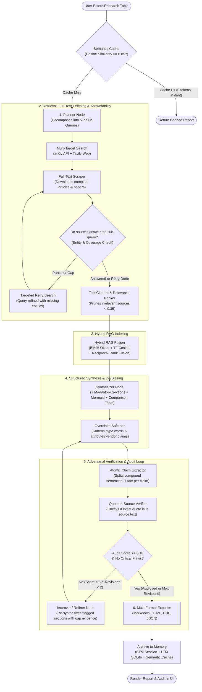

# 🧠 How the AI Research Assistant Works: Complete Guide & Architecture

This document explains **how the Research Assistant agent works**, step by step, from the moment you enter a research topic to the final generation of a verified, publication-grade report.

---

## 🧭 1. Mental Model: Why Is This Not Just "ChatGPT with Search"?

Standard generative AI tools often produce plausible-sounding reports that contain **hallucinated metrics, broken citations, and marketing buzzwords**. When an LLM searches the web normally, it usually reads search snippets (100–200 characters), makes broad generalizations, and rubber-stamps its own output as "10/10 accurate".

This Research Assistant is an **adversarial, multi-stage autonomous agent** built on **LangGraph**. It treats research like an investigative journalist and peer-reviewer:

1. **It doesn't search once**: It decomposes your topic into 5 to 7 orthogonal technical dimensions.
2. **It doesn't stop at snippets**: It downloads full HTML web pages and arXiv scientific papers (thousands of words).
3. **It checks its own coverage**: If retrieved sources don't answer a sub-query, it autonomously runs a targeted retry search.
4. **It strips promotional bias**: Commercial hype words like *"revolutionary"* and *"unprecedented"* are neutralized, and claims are attributed to vendors.
5. **It enforces the "Quote-in-Source" rule**: A claim is **never** considered supported unless its verbatim quote exists as an exact substring in the cited source text.
6. **It self-heals**: If the audit score is below 8/10, a Refiner agent rewrites the weak sections. If an LLM API runs out of quota, a Gateway instantly switches models with zero latency.

---

## 🔄 2. The Complete Pipeline Workflow

The flowchart below shows the entire journey of a research request:

---

## ⚙️ 3. Step-by-Step Breakdown of How Each Component Works

### Step 1: Semantic Cache (Instant Recall)
- **What happens**: Before calling expensive LLMs or search APIs, the system encodes the user query into a vector representation and compares it to previously completed research in SQLite.
- **Why it matters**: If someone asks *"Recent advances in quantum computing"* and later asks *"Recent progress in quantum computing"*, cosine similarity matches $\ge 0.85$. The report is returned **instantly at 0 token cost**.

### Step 2: Query Decomposition (`Planner Node`)
- **What happens**: The Planner takes a broad topic (e.g., *"Quantum Computing Benchmarks 2025"*) and decomposes it into **5 to 7 specialized sub-queries**.
- **The 7 Orthogonal Dimensions**:
  1. *Architectural & Hardware Foundations* (e.g., superconducting circuits, neutral atoms, trapped ions).
  2. *Quantitative Benchmarks* (e.g., two-qubit gate fidelities, coherence times, quantum volume).
  3. *Error Correction & Logical Qubits* (e.g., surface codes, color codes, fault-tolerant thresholds).
  4. *Software Stacks & Compilers* (e.g., Qiskit, Cirq, quantum annealing frameworks).
  5. *Preclinical / Industrial Implementations* (e.g., chemistry simulations, optimization).
  6. *Bottlenecks & Scaling Challenges* (e.g., cryogenics, crosstalk, interconnects).
  7. *Commercial Roadmap & Future Horizons* (e.g., 2026–2030 roadmaps of IBM, Quantinuum, Google).

### Step 3: Retrieval & Full-Text Fetching (`Retriever`)
- **Dual-Engine Search**: For each sub-query, the agent runs concurrent queries against:
  - **arXiv API**: Scrapes peer-reviewed scientific preprints and academic literature.
  - **Tavily Search**: Queries trusted web sources, technical whitepapers, and industry announcements.
- **Full-Text Ingestion (`tools/full_text_fetcher.py`)**:
  - Instead of relying on 200-character snippets, the agent fetches the **full web page body** (using `trafilatura` and `BeautifulSoup`) and arXiv PDFs.
  - Cleans out cookie banners, navigation menus, ads, and footers, extracting 4,000 to 12,000 characters of high-density technical evidence per source.

### Step 4: Coverage Verification & Targeted Retries
- **Answerability Check**: After fetching sources for a sub-query, an LLM checks:
  > *"Do these retrieved sources actually answer the sub-query? List the named entities (vendors, frameworks, benchmarks) covered."*
- **Targeted Retry**:
  - If the sources do not answer the sub-query or only answer it partially, the status is marked **"Partial"** or **"Gap"**.
  - The agent automatically issues a **targeted retry query** targeting the missing entities and evaluation metrics.
  - If a sub-query still cannot be answered after retry, the agent records an explicit gap note in the report rather than hallucinating filler text.

### Step 5: Authority Filtering & Hybrid RAG
- **Authority Filtering**: Sources from social media, native advertisements, or domains below a 0.35 relevance threshold are discarded. arXiv scientific papers automatically receive an authority boost.
- **Hybrid RAG Indexing (`src/rag/hybrid_indexer.py`)**:
  - Documents are chunked into 500-token passages with 100-token overlaps.
  - Uses **BM25 Okapi** (keyword search for exact terms like *"transmon"* or *"fidelity"*) combined with **TF-Cosine Semantic Similarity**.
  - Merged using **Reciprocal Rank Fusion (RRF)**:
    $$\text{RRF Score}(d) = \sum_{m \in \{\text{BM25}, \text{TF}\}} \frac{1}{60 + \text{Rank}_m(d)}$$
  - Delivers high-relevance evidence chunks directly into the synthesis prompt.

### Step 6: Structured Synthesis & Overclaim Softening (`Synthesizer Node`)
- **Strict 7-Section Architecture**: The synthesizer must generate:
  1. Abstract
  2. Executive Summary
  3. Architectural & Technical Foundations
  4. Quantitative Performance & Benchmarks (with a comparative Markdown table)
  5. Systems Architecture & Workflows (with a valid Mermaid diagram)
  6. Practical Bottlenecks & Failure Modes
  7. Future Horizons & Strategic Roadmap
- **Overclaim Softening (`_soften_synthesized_sections`)**:
  - Eliminates hype words (*"revolutionary"*, *"game-changing"*, *"unprecedented"*).
  - Automatically prepends vendor attribution to self-reported commercial statistics (e.g. *"NVIDIA claims..."* or *"IBM states..."*).

### Step 7: Adversarial Verification & The Quote-in-Source Audit (`Verifier Node`)
This is the core safeguard against hallucination. Most systems ask an LLM *"Is this report good?"*, and the LLM responds *"Yes, 10/10"*.

Our verifier executes a strict **claim-level audit**:
1. **One Fact per Claim**: The verifier extracts factual statements and splits compound sentences so every row in the audit contains a single verifiable fact.
2. **Exact Quote Validation**: For every claim, the verifier extracts the exact quote cited from the source.
3. **Substring Search**: The system runs `_is_quote_in_source`:
   - Normalizes whitespace, punctuation, and casing.
   - Searches the actual text of the cited source.
   - **If the quote does not appear verbatim in the source text, the claim is marked `UNVERIFIED`**.
4. **Transparent Audit Table**: The report footer displays a complete audit table listing every single claim, its cited source, the quote status (`SUPPORTED`, `CONTRADICTED`, `UNVERIFIED`), and whether it passed.

### Step 8: Self-Correction Loop (`Refiner Node`)
- If the verification score is **$\ge 8/10$** and there are no severe factual contradictions, the report is **Approved**.
- If the score is **$< 8/10$** and fewer than 2 revisions have occurred:
  - The **Refiner Node** takes the verifier's feedback, the unverified claims, and the hybrid RAG evidence.
  - It surgically rewrites the failing sections to remove unsupported claims and ground them with verifiable quotes.
  - The revised draft is sent back to the Verifier for re-evaluation.

### Step 9: LLM Gateway & Resilience Engine (`src/chains/gateway.py`)
LLM APIs can fail due to rate limits or daily free-tier quotas. The Research Assistant includes an autonomous resilience layer:
- **Circuit Breaker**: Tracks API failures per model. If a model fails repeatedly, the breaker trips open to avoid hammering the API.
- **Quota Fast-Failover**: If an API returns `RESOURCE_EXHAUSTED` (such as Google AI Studio's 20-request/day free-tier preview limit), the gateway recognizes that waiting 40 seconds will not help. It **instantly trips the breaker with 0 seconds delay** and fails over to `gemini-3.5-flash-lite` or Groq.
- **JSON Self-Healing**: If a model outputs slightly malformed JSON during structured output calls, `_attempt_json_recovery` progressively cleans and balances brackets to parse the data without failing the run.

### Step 10: Multi-Format Export & Long-Term Memory
- **Exporters (`src/utils/exporter.py`)**:
  - Generates GitHub Flavored Markdown with a clickable Table of Contents.
  - Compiles clean HTML with interactive Mermaid diagram rendering and hoverable citation tooltips.
  - Exports publication-ready PDFs (via ReportLab or WeasyPrint).
- **Dual Memory**:
  - **Short-Term Memory (STM)**: In-memory/Redis session state tracking the live graph execution.
  - **Long-Term Memory (LTM)**: Persistent SQLite database storing historical topics, sources, verification scores, and full reports.

---

## 🗺️ 4. Codebase Navigation Map

| Directory / File | Responsibility |
| :--- | :--- |
| [`src/graphs/research_graph.py`](file:///c:/Users/hites/OneDrive/Desktop/krish%20naik/research%20assistant/src/graphs/research_graph.py) | Defines the LangGraph state machine, nodes, conditional edges, and execution loop. |
| [`src/graphs/nodes.py`](file:///c:/Users/hites/OneDrive/Desktop/krish%20naik/research%20assistant/src/graphs/nodes.py) | Core graph node implementations: `plan_node`, `retrieve_node`, `synthesize_node`, `verify_node`, `improve_node`. |
| [`src/chains/gateway.py`](file:///c:/Users/hites/OneDrive/Desktop/krish%20naik/research%20assistant/src/chains/gateway.py) | Resilient LLM Gateway with Circuit Breaker, exponential backoff, JSON recovery, and fast quota failover. |
| [`src/chains/planner.py`](file:///c:/Users/hites/OneDrive/Desktop/krish%20naik/research%20assistant/src/chains/planner.py) | Multi-dimensional query decomposition prompt and schema binding. |
| [`src/chains/synthesizer.py`](file:///c:/Users/hites/OneDrive/Desktop/krish%20naik/research%20assistant/src/chains/synthesizer.py) | 7-section report generator, Mermaid diagram creator, and benchmark table formatter. |
| [`src/chains/verifier.py`](file:///c:/Users/hites/OneDrive/Desktop/krish%20naik/research%20assistant/src/chains/verifier.py) | Adversarial claim extractor, quote-in-source substring validator, and factual auditor. |
| [`src/chains/refiner.py`](file:///c:/Users/hites/OneDrive/Desktop/krish%20naik/research%20assistant/src/chains/refiner.py) | Self-correction engine that repairs draft deficiencies flagged during verification. |
| [`src/tools/full_text_fetcher.py`](file:///c:/Users/hites/OneDrive/Desktop/krish%20naik/research%20assistant/src/tools/full_text_fetcher.py) | Scrapes and cleans full-body text from web URLs and arXiv preprints. |
| [`src/rag/hybrid_indexer.py`](file:///c:/Users/hites/OneDrive/Desktop/krish%20naik/research%20assistant/src/rag/hybrid_indexer.py) | BM25 Okapi + TF-Cosine RRF hybrid search indexer. |
| [`src/utils/exporter.py`](file:///c:/Users/hites/OneDrive/Desktop/krish%20naik/research%20assistant/src/utils/exporter.py) | Formats and outputs Markdown, HTML, PDF reports, and claim audit tables. |
| [`app.py`](file:///c:/Users/hites/OneDrive/Desktop/krish%20naik/research%20assistant/app.py) | Interactive Streamlit user interface with live step tracking, audit breakdown, and PDF download. |

---

## 📊 5. Summary of Key Guarantees

1. **No Phantom Citations**: Every `[N]` in the report corresponds to an actual source indexed during retrieval.
2. **No Fabricated Quotes**: Claims marked as `SUPPORTED` must have exact, verifiable character substrings within the cited source.
3. **No Hollow Snippet Summaries**: Sources are read in full length, ensuring actual numerical benchmarks and architectures are extracted.
4. **Autonomous Resilience**: Network errors and model quota limits trigger instant failovers rather than aborting your research session.
