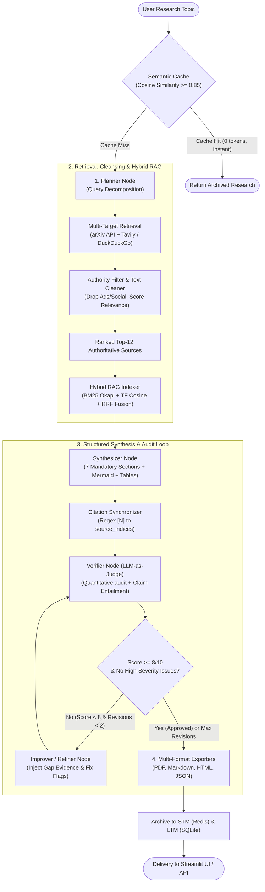

# 🔬 AI Research Assistant: High-Quality Research Pipeline Architecture

An enterprise-grade, deterministic research engine built on **LangGraph**, **Hybrid RAG (BM25 + TF Cosine RRF)**, an **LLM Gateway with Circuit Breaking**, and an **Autonomous Verifier-Refiner Audit Loop**.

Designed to eliminate factual hallucinations, citation drift, and secondary source pollution while producing publication-grade technical research reports.

---

## 🏗️ 1. End-to-End Pipeline Architecture

---

## ⚡ 2. Core Pillars of Research Quality

### 1. Multi-Dimensional Query Decomposition (`Planner`)
Standard LLM research tools submit raw user queries directly to search engines, leading to shallow search results. The **Planner Node** systematically decomposes queries into 5 to 7 orthogonal dimensions:
- **Architectural Foundations**: Core algorithms, neural models, and workflows.
- **Structural / Biological Targets**: Specific identification methods (e.g., AlphaFold DB, cryo-EM).
- **Mandatory Quantitative Benchmarks**: Success rates, accuracy metrics, and baseline comparisons.
- **Preclinical Bottlenecks**: Data scarcity, out-of-distribution generalization, and ADMET challenges.
- **Real-World Deployments**: Named industrial case studies and clinical pipelines.
- **Regulatory Frameworks**: FDA/EMA guidance, credibility assessments, and IP standards.
- **Future Horizons**: Quantum-classical algorithms, multimodal models, and long-term outlook.

### 2. Authority Filtering & Zero-Truncation Alignment (`Retriever`)
Search engines often return promotional material, social commentary, and irrelevant keyword collisions. The **Text Cleaner & Filter** actively sanitizes incoming sources:
- **Social Media & Ad Suppression**: Detects and purges low-authority sources (`linkedin.com`, `reddit.com`, `twitter.com`, `/sponsored/`, `/native-ad/`).
- **Domain-Relevance Ranking**: Scores textual overlap against domain keywords, filtering out false positives (e.g. economics/statistics or particle physics papers returning under general search terms).
- **Academic Authority Weighting**: Automatically assigns a **+2.5 priority boost** to peer-reviewed arXiv papers.
- **1-to-1 Context Alignment**: Caps the working set to the top 12 authoritative sources so the prompt context and in-memory source list match identically, eliminating out-of-context citation guessing.

### 3. Hybrid RAG Engine (`BM25 + Vector + Reciprocal Rank Fusion`)
To provide deep passage-level grounding, retrieved sources are split into overlapping chunks and indexed using a dual retrieval approach:
1. **BM25 Okapi**: Exact keyword, gene name, and chemical abbreviation matching.
2. **Sparse TF Vector Cosine Similarity**: Conceptual semantic matching.
3. **Reciprocal Rank Fusion (RRF)**: Re-ranks passages using the constant $k = 60$:
   $$\text{RRF Score} = \frac{1}{60 + \text{Rank}_{\text{BM25}}} + \frac{1}{60 + \text{Rank}_{\text{Vector}}}$$

Targeted passages are dynamically injected into the **Synthesizer**, **Verifier**, and **Refiner** prompts to substantiate complex technical claims.

### 4. Mandatory Publication-Grade Structure (`Synthesizer`)
Every research report adheres to a rigorous 7-section structure:
1. **Abstract**: Structured single-paragraph overview (Background, Methods, Results, Conclusion).
2. **Executive Summary & Paradigm Shift**: Opens with a `> **Core Insight:**` callout.
3. **Architectural Evolution & Key Milestones**: Chronological subsections (`3.1`, `3.2`) with timeline tables.
4. **Technical Architecture & Methodologies**: Deep prose accompanied by an executable Mermaid architecture diagram.
5. **Comparative Performance Benchmarks**: Multi-column comparison tables citing concrete numerical metrics.
6. **Practical Applications & Industrial Impact**: Real-world deployments with a domain-impact matrix.
7. **Research Gaps & Future Horizons**: Critical technical challenges and 3–5 year trajectory.

*Every assertion must carry an inline citation `[N]`. A post-synthesis citation synchronizer automatically binds in-text citations to the structured Pydantic schema.*

### 5. Claim-Level LLM-as-Judge Fact Checker (`Verifier`)
The Verifier acts as an adversarial academic reviewer evaluating factual entailment rather than superficial formatting:
- **Quantitative Audit**: Validates every percentage, ratio, and benchmark number against source text. Unsubstantiated metrics are flagged as High Severity.
- **Citation Relevance**: Detects domain misattributions and conflated claims across disparate papers.
- **Approval Policy**:
  $$\text{Approved} \iff (\text{Score} \ge 8/10) \land (\text{High-Severity Issues} == 0)$$

### 6. Self-Healing Research Loop (`Refiner`)
When a report fails verification (score $< 8/10$), the graph automatically transitions to the Refiner node:
- Injects targeted gap evidence from the Hybrid RAG index.
- Explicitly removes, rewrites, or qualifies flagged claims.
- Re-submits the updated report to the Verifier for a second pass.

---

## 🛡️ 3. Fault-Tolerant Infrastructure

| Component | Technology | Purpose |
|---|---|---|
| **State Machine** | `LangGraph` | Stateful node transitions, streaming progress, and conditional revision edges. |
| **Model Gateway** | `LLMGateway` | Circuit breakers, exponential backoff, and automatic fallback failover. |
| **Short-Term Memory** | `Redis STM` | Real-time session state, active node tracking, and multi-user isolation. |
| **Long-Term Memory** | `SQLite / pgvector` | Historical research archival and vector search across past reports. |
| **Semantic Cache** | Cosine Similarity | Instant zero-token retrieval for repeat or highly similar inquiries ($\ge 0.85$ similarity). |
| **Multi-Format Export** | `ReportLab / MD / HTML` | Two-pass publication PDF generation with tables, figures, and styling. |

---

## 📊 4. Quality Benchmark Comparison

| Dimension | Typical AI Summarizer | AI Research Assistant |
|---|---|---|
| **Query Strategy** | Single ungrounded prompt | 5–7 orthogonal sub-queries targeting benchmarks & architectures |
| **Source Authority** | Blends ads, blogs, and social media | Drops ads/social media; prioritizes peer-reviewed primary literature |
| **Context Consistency** | Truncates sources silently; model guesses | Top-12 sources aligned 1-to-1 with prompt context |
| **Passage Precision** | Entire raw pages dumped into context | Hybrid RAG (BM25 + Cosine + RRF) node-level evidence injection |
| **Verification Depth** | Superficial or nonexistent | Adversarial LLM-as-judge auditing numbers and claim entailment |
| **Self-Correction** | Single-pass (errors remain in final text) | Autonomous iterative critique-refinement loop (up to 2 revisions) |
| **Export Formats** | Plain text | Publication-ready PDF, styled HTML, GitHub Markdown, and JSON |
