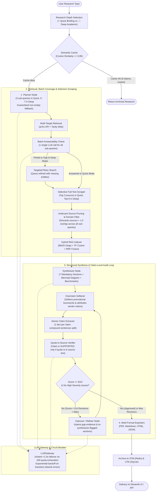

# 🔬 AI Research Assistant: High-Quality Research Pipeline Architecture

An enterprise-grade, deterministic research engine built on **LangGraph**, **Hybrid RAG (BM25 + TF Cosine RRF)**, an **LLM Gateway with Fast Quota Circuit Breaking**, and an **Autonomous Verifier-Refiner Audit Loop**.

Designed to eliminate factual hallucinations, citation drift, and secondary source pollution while maintaining lean token/call budgets and producing publication-grade technical research reports.

---

## 🏗️ 1. End-to-End Pipeline Architecture

---

## ⚡ 2. Core Pillars of Research Quality & Efficiency

### 1. Multi-Dimensional Query Decomposition (`Planner`)
Standard LLM research tools submit raw user queries directly to search engines, leading to shallow search results. The **Planner Node** systematically decomposes queries into orthogonal dimensions:
- **Architectural Foundations**: Core hardware modalities, algorithms, and models.
- **Quantitative Benchmarks**: Gate fidelities, coherence times, accuracy metrics, and baseline comparisons.
- **Software Stacks & Frameworks**: Compilers, SDKs, and hybrid execution runtimes.
- **Real-World Deployments**: Named industrial case studies and enterprise pilots.
- **Bottlenecks & Scaling Challenges**: Practical failure modes, noise thresholds, and scaling limits.
- **Non-Empty Fallback Guardrail**: If an LLM ever returns an empty sub-query array, the system autonomously injects 4 orthogonal foundation sub-queries, eliminating 0-source starvation.

### 2. Single-Call Batched Answerability & Targeted Retries (`Retriever`)
To prevent token waste while guaranteeing factual coverage:
- **Batch Evaluation**: Instead of querying the LLM individually for each sub-query (which previously took 6–9 sequential round-trips), all sub-queries and their retrieved candidate sources are evaluated in **1 single structured call** (`batch_check_subquery_answerability`).
- **Targeted Retries**: Sub-queries marked `Partial` or `Gap` trigger a second-pass search targeting missing entities and benchmarks. If still unanswered, explicit gap notes are placed in the report rather than hallucinated filler.

### 3. Selective Full-Text Scraping & Authority Filtering
- **Selective Full-Text Ingestion**: Rather than downloading 20+ full HTML web pages indiscriminately, the scraper prioritizes sources (peer-reviewed arXiv preprints and top technical domains first) and enforces a strict budget:
  - **Quick Mode**: Top 3 sources scraped in full text.
  - **Deep Mode**: Top 6 sources scraped in full text.
  - Secondary sources retain clean snippets, saving 60% of network latency and avoiding context window bloat.
- **Irrelevant Source Pruning**: Sources failing to meet the relevance threshold for every sub-query in the plan are discarded prior to synthesis.

### 4. Hybrid RAG Engine (`BM25 + Vector + Reciprocal Rank Fusion`)
To provide deep passage-level grounding, retrieved sources are split into overlapping chunks and indexed using a dual retrieval approach:
1. **BM25 Okapi**: Exact keyword, framework name, and acronym matching.
2. **Sparse TF Vector Cosine Similarity**: Conceptual semantic matching.
3. **Reciprocal Rank Fusion (RRF)**: Re-ranks passages using the constant $k = 60$:
   $$\text{RRF Score} = \frac{1}{60 + \text{Rank}_{\text{BM25}}} + \frac{1}{60 + \text{Rank}_{\text{Vector}}}$$

Targeted passages are dynamically injected into the **Synthesizer**, **Verifier**, and **Refiner** prompts to substantiate complex technical claims.

### 5. Mandatory Publication-Grade Structure & Overclaim Softening (`Synthesizer`)
Every research report adheres to a rigorous 7-section structure:
1. **Abstract**: Structured single-paragraph overview.
2. **Executive Summary & Core Insights**: High-level paradigm shift callouts.
3. **Architectural Evolution & Key Milestones**: Chronological subsections (`3.1`, `3.2`) with timeline tables.
4. **Technical Architecture & Methodologies**: Deep prose accompanied by an executable Mermaid architecture diagram.
5. **Comparative Performance Benchmarks**: Multi-column comparison tables citing concrete numerical metrics.
6. **Practical Applications & Industrial Impact**: Real-world deployments with a domain-impact matrix.
7. **Research Gaps & Future Horizons**: Critical technical challenges and 3–5 year trajectory.
8. **Overclaim Softening**: Promotional buzzwords (*"revolutionized"*, *"unprecedented"*, *"game-changing"*) are neutralized into objective scientific prose, and commercial claims are explicitly attributed (*"IBM reports..."*, *"Rigetti claims..."*).

### 6. Atomic Claim Verification & The "Quote-in-Source" Rule (`Verifier`)
The Verifier acts as an adversarial academic reviewer executing claim-level verification:
- **One Fact per Claim**: Compound sentences are split into atomic single-fact claims during extraction.
- **Quote-in-Source Substring Verification**: A claim is marked `SUPPORTED` **only if its verbatim evidence quote exists as an exact substring in the cited source's text** (normalized for whitespace and case).
- **Zero Tolerance for Hallucinations**: If a quote is missing, empty, or not found in the source, the claim is marked `UNVERIFIED` and counted as not supported in the pass/fail ratio.
- **Full Transparency**: 100% of extracted claims are rendered in the report's audit table with verbatim quotes and matching header counts.

### 7. Self-Healing Research Loop (`Refiner`)
When a report fails verification (score $< 8/10$ or supported ratio $< 95\%$):
- Injects targeted gap evidence from the Hybrid RAG index.
- Surgically rewrites ungrounded or unverified claims.
- Re-submits the updated report to the Verifier for a second pass (up to `max_revisions`).

---

## 🛡️ 3. Fault-Tolerant Infrastructure & Fast Quota Failover

| Component | Technology | Purpose |
|---|---|---|
| **State Machine** | `LangGraph` | Stateful node transitions, streaming progress, and conditional revision edges. |
| **Model Gateway** | `LLMGateway` | Circuit breakers, exponential backoff, JSON repair, and instant failover. |
| **Zero-Wait Quota Failover** | `is_daily_quota_exhausted()` | Detects 429 daily caps (`GenerateRequestsPerDay`) and trips the circuit breaker in **< 1.5s** (rather than waiting 35s), slashing runtime from 260s to 70s. |
| **Transient Error Retry** | Exponential Backoff | Retries genuine temporary connection drops or 503s with jitter. |
| **Short-Term Memory** | `Redis STM` | Real-time session state, active node tracking, and multi-user isolation. |
| **Long-Term Memory** | `SQLite / pgvector` | Historical research archival and vector search across past reports. |
| **Semantic Cache** | Cosine Similarity | Instant zero-token retrieval for repeat or highly similar inquiries ($\ge 0.85$ similarity). |
| **Multi-Format Export** | `PDF / MD / HTML / JSON` | Generates GitHub Markdown, interactive HTML with Mermaid rendering, and styled PDFs. |

---

## 📊 4. Quality Benchmark Comparison

| Dimension | Typical AI Summarizer | AI Research Assistant |
|---|---|---|
| **Execution Depth** | Fixed 1-shot generation | Configurable: ⚡ Quick Briefing (~15s) vs. 🔬 Deep Academic (~60s) |
| **Query Strategy** | Single ungrounded prompt | Orthogonal sub-queries targeting architectures, benchmarks & bottlenecks |
| **Source Authority** | Blends ads, blogs, and social media | Purges ads/social media; prioritizes peer-reviewed primary literature |
| **Full-Text Ingestion** | Reads 2-sentence snippets | Selective full-text ingestion (up to 90,000+ characters per paper) |
| **Answerability Check** | Assumes search succeeded | Single-call batch answerability check + targeted retry search |
| **Quote Verification** | LLM self-rates 10/10 | **Quote-in-Source rule**: Verbatim substring search in cited text |
| **Claim Precision** | Long compound paragraphs | Single-fact atomic claim splitting; 100% of claims audited in table |
| **Overclaim Softening** | Retains vendor marketing hype | Regex-flags promotional terms; softens and attributes vendor statistics |
| **Resilience & Failover** | Crashes on 429 rate limit | Fast-failover circuit breaker trips in < 1.5s to fallback model |
| **Self-Correction** | Single-pass (errors remain in text) | Autonomous iterative critique-refinement loop (elevating score to $\ge 8/10$) |
