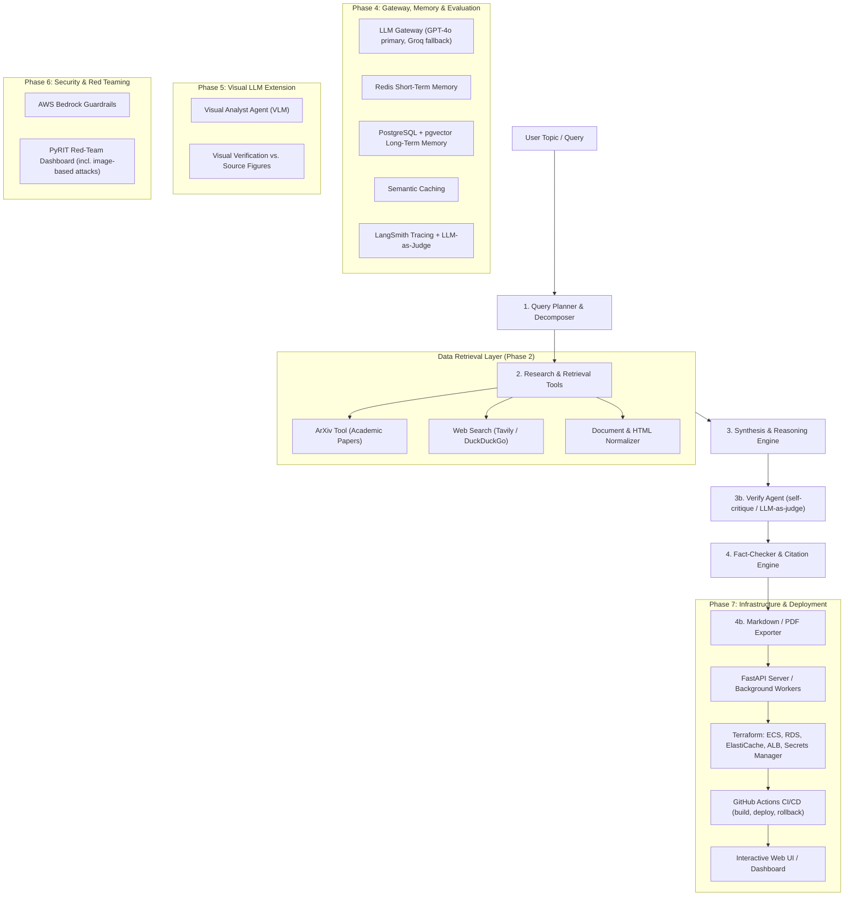

# 🔬 AI Research Assistant — Enterprise Multi-Agent Platform

An autonomous, production-grade AI Research Platform built with a **100% textbook LangChain & LangGraph** architecture, extended with an **LLM Gateway**, **layered memory (Redis STM + pgvector LTM)**, **semantic caching**, **Visual LLM (VLM) analysis**, **AWS Bedrock Guardrails**, and **PyRIT Red Teaming**.

> **Base Project:** Krish Naik — Multi-Agent AI Research Platform with AWS Guardrails, LLM Gateway, Red Teaming, STM/LTM & Semantic Caching, extended with a Visual LLM agent  
> **Timeline:** Aug 2026 – Nov 2026

---

## 🧭 System Architecture



---

## ✨ Platform Highlights

### 🟢 Built & Operational (Phases 1–3)
- **🧠 100% Textbook LangChain & LangGraph Multi-Agent Architecture**:
  - Declarative state machine via **LangGraph `StateGraph`** (`START ➔ planner ➔ retriever ➔ synthesizer ➔ END`).
  - Decoupled `src/prompts/` (versioned `ChatPromptTemplate`s), `src/chains/` (reusable LCEL runnables), and `src/graphs/` (state graph nodes and event streaming).
- **📋 Autonomous Query Decomposition**:
  - Breaks broad topics into 3–5 targeted sub-questions with search keyword formulation and channel routing (`arxiv`, `web`, or `both`).
- **📚 Multi-Source Ingestion & Resilient Retrieval**:
  - **Academic Preprints**: Direct arXiv API integration extracting titles, authors, abstracts, dates, and direct PDF links with resilient socket timeouts.
  - **Web Intelligence**: Primary integration with **Tavily Search API**, with zero-config automatic fallback to **DuckDuckGo Search**.
- **🧹 Content Normalization & Pruning**:
  - Strips HTML boilerplate and deduplicates across sub-queries into a unified `ResearchSource` stream.
- **⚗️ Structured Synthesis with Source Citations**:
  - Direct Pydantic structured output mapping findings into *Key Findings*, *Technical Approaches*, *Consensus & Controversies*, *Research Gaps*, *Practical Applications*, and *Future Directions*.
  - Strict 0-based source citation tagging (`[0]`, `[1]`, `[2]`).
- **🖥️ Dual-Mode Streamlit Dashboard (`app.py`)**:
  - **Full Research**: Real-time LangGraph streaming progress indicators, tabbed report view, query plan breakdown, and source cards.
  - **Tools Explorer**: Manual testing and inspection interface for arXiv and web search queries.
- **🧪 26 Passing Unit Tests**: Complete coverage of graph compilation, nodes, fallback recovery, and schemas.

### 🟡 Roadmap Extensions (Phases 4–7)
- **🎯 Discrete Verify Agent (Self-Critique)**: Adds a distinct verification node (`START ➔ planner ➔ retriever ➔ synthesizer ➔ verify ➔ END`) to score faithfulness and flag ungrounded assertions before report generation.
- **🛡️ LLM Gateway & Layered Memory (Phase 4)**:
  - TensorZero-style gateway: GPT-4o primary with automatic Groq fallback, circuit breaking, and retries.
  - Redis Short-Term Memory (session-level context).
  - PostgreSQL + `pgvector` Long-Term Memory (cross-session research retrieval).
  - Semantic Caching for near-duplicate research queries.
  - LangSmith tracing with automated LLM-as-judge scoring.
- **👁️ Visual LLM Extension (Phase 5)**:
  - Standalone Visual Analyst agent (GPT-4o Vision / Qwen-VL / LLaVA) parsing figures and charts from research papers.
  - Visual verification cross-checking written numerical claims against actual figures.
- **🔒 Security & Red Teaming (Phase 6)**:
  - AWS Bedrock Guardrails for input/output sanitization.
  - Automated PyRIT red-team dashboard executing jailbreak, XPIA (cross-prompt injection), crescendo, and image-based adversarial attacks.
- **🚀 Enterprise Infrastructure & CI/CD (Phase 7)**:
  - Terraform AWS infrastructure provisioning (ECS, RDS, ElastiCache, ALB, Secrets Manager, ECR, VPC).
  - GitHub Actions CI/CD with automated build, deployment, and blue-green rollback on test failures.
  - Production FastAPI REST API and multi-format report exporter (Markdown, PDF, JSON).

---

## 🚀 Quickstart Guide

### 1. Prerequisites
- Python 3.11+
- [`uv`](https://github.com/astral-sh/uv) (recommended) or standard `pip`

### 2. Environment Setup
```powershell
# Create virtual environment using uv
uv venv .venv

# Activate environment (Windows)
.venv\Scripts\activate

# Install dependencies
uv pip install -r requirements.txt
```

### 3. Configure API Keys
Copy the template file:
```powershell
cp .env.example .env
```
Open [.env](.env) and add your keys:
```ini
# Primary LLM (Free tier: https://console.groq.com)
GROQ_API_KEY=your_groq_api_key_here
GROQ_MODEL=llama-3.3-70b-versatile

# Web Search (Free tier: https://tavily.com - optional, fallback is DuckDuckGo)
TAVILY_API_KEY=your_tavily_api_key_here
SEARCH_ENGINE=tavily
```

---

## 🖥️ Running the Application

### Interactive Streamlit Dashboard
Launch the web interface:
```powershell
streamlit run app.py
```
Open your browser at **`http://localhost:8501`** (or the port shown in terminal).

### Command-Line Interface (CLI)
Run a full research run directly in your terminal:
```powershell
python -m src.agents --topic "Quantum Machine Learning" --papers 2 --web 2
```

---

## 🧪 Testing & Verification

Run the automated test suite across all modules:
```powershell
# Run the complete test suite (26 passing tests)
uv run pytest tests/test_graphs.py tests/test_agents.py tests/test_config.py -v

# Run fast tool normalization tests
uv run pytest tests/test_tools.py -k "not test_arxiv_search and not test_web_search"
```

---

## 📋 Project Directory Structure

```text
research_assistant/
├── config/                  # Configuration & pydantic environment loader
├── src/
│   ├── prompts/             # Textbook LangChain: Decoupled ChatPromptTemplates
│   │   ├── __init__.py
│   │   ├── planner.py       # Query decomposition prompt template
│   │   └── synthesizer.py   # Source synthesis prompt template
│   ├── chains/              # Textbook LangChain: Composable LCEL runnables
│   │   ├── __init__.py
│   │   ├── llm.py           # ChatGroq model factory
│   │   ├── planner.py       # LCEL chain: planner_prompt | llm.with_structured_output(QueryPlan)
│   │   └── synthesizer.py   # LCEL chain: synthesizer_prompt | llm.with_structured_output(SynthesisReport)
│   ├── graphs/              # Textbook LangGraph: Multi-agent StateGraph
│   │   ├── __init__.py
│   │   ├── state.py         # ResearchGraphState TypedDict schema
│   │   ├── nodes.py         # Graph nodes (plan_node, retrieve_node, synthesize_node)
│   │   └── graph.py         # StateGraph assembly, compilation, and streaming run_research()
│   ├── tools/               # Registered @tool definitions and retrieval engines
│   │   ├── arxiv_tool.py    # arXiv search with resilient socket timeout
│   │   ├── web_search_tool.py # Tavily + DuckDuckGo search
│   │   ├── text_cleaner.py  # Content normalization and deduplication
│   │   └── langchain_tools.py # LangChain @tool wrappers (arxiv_search, web_search)
│   ├── models/              # Pydantic schemas (QueryPlan, SynthesisSection, ResearchResult)
│   ├── utils/               # Structured logger
│   ├── agents/              # Backward-compatibility facades delegating to chains & graphs
│   └── server/              # API backend (Phase 7)
├── tests/
│   ├── test_graphs.py       # LangGraph state machine & node unit tests
│   ├── test_agents.py       # Backward-compatibility facade tests
│   ├── test_config.py       # Settings & environment validation tests
│   └── test_tools.py        # Tool normalization & retrieval tests
├── data/                    # Saved research reports and cache
├── app.py                   # Streamlit interactive dashboard
├── .env.example             # Environment variables template
├── requirements.txt         # Project dependencies
├── plan.md                  # Master milestone roadmap with checkpoints
├── LICENSE                  # MIT License
└── README.md                # Project documentation
```

---

## 🗺️ Roadmap & Milestones

Track our step-by-step development in [plan.md](plan.md):

| Step | Milestone | Status | Details / Focus Areas |
|:-----|:----------|:------:|:----------------------|
| **Phase 1** | Project Scaffolding & Setup | 🟢 Completed | Modular layout, `uv` environment, Pydantic settings, logging |
| **Phase 2** | Research Tools & Ingestion | 🟢 Completed | arXiv + Tavily/DDG search, text cleaner, source deduplication, Streamlit explorer |
| **Phase 3** | Reasoning & Agentic Pipeline | 🟡 Mostly Complete | LangChain LCEL, LangGraph `StateGraph`, 26 tests pass; discrete Verify agent pending |
| **Phase 4** | Gateway, Memory & Evaluation | 🎯 Next Up | LLM Gateway (GPT-4o / Groq fallback), Redis STM, pgvector LTM, Semantic Caching, LangSmith |
| **Phase 5** | Visual LLM Extension | ⚪ Pending | VLM Visual Analyst agent, multimodal RAG, figure verification |
| **Phase 6** | Security & Red Teaming | ⚪ Pending | AWS Bedrock Guardrails, PyRIT red-team dashboard (text & image attacks) |
| **Phase 7** | Infrastructure & Deployment | ⚪ Pending | Terraform on AWS (ECS, RDS, ALB), GitHub Actions CI/CD, FastAPI, report exporter |

---

## 📄 License

This project is licensed under the [MIT License](LICENSE).
