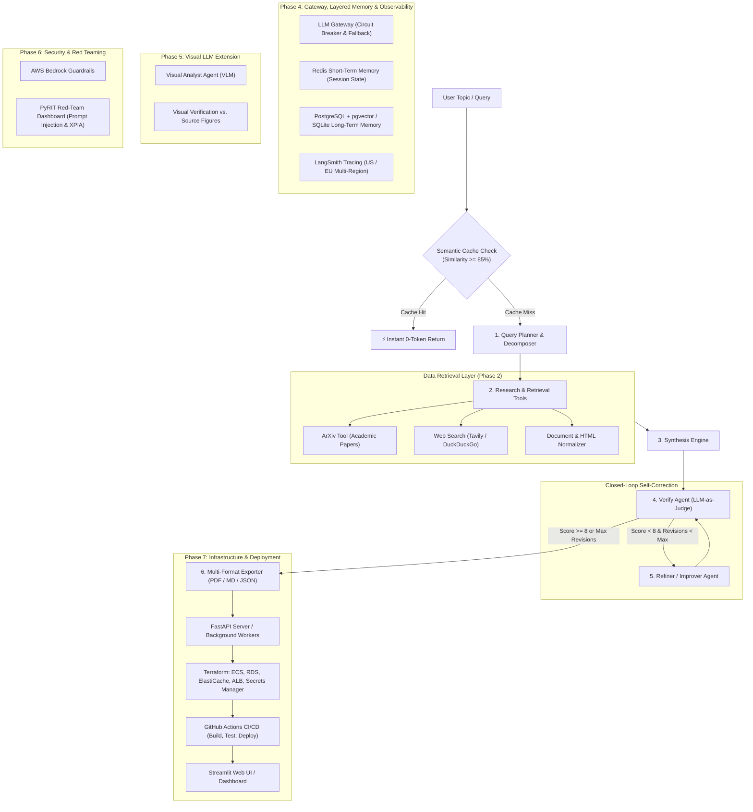

# 🔬 AI Research Assistant — Enterprise Multi-Agent Platform

An autonomous, production-grade AI Research Platform built with a **100% textbook LangChain & LangGraph** architecture, featuring an **LLM Gateway with Circuit Breakers**, **Layered Memory (Redis STM + SQLite/pgvector LTM)**, **Semantic Caching**, **Closed-Loop Self-Refinement**, **Automated LLM-as-Judge Evaluation**, **Publication-Ready PDF/Markdown/JSON Exporters**, and **Multi-Region LangSmith Observability**.

> **Base Project:** Krish Naik — Multi-Agent AI Research Platform with AWS Guardrails, LLM Gateway, Red Teaming, STM/LTM & Semantic Caching, extended with a Visual LLM agent

---

## 🧭 System Architecture



---

## ✨ Platform Highlights

### 🟢 Built & Operational (Phases 1–4)

- **🧠 100% Textbook LangChain & LangGraph Multi-Agent Architecture**:
  - Declarative state machine via **LangGraph `StateGraph`** with full node lifecycle and event streaming.
  - Decoupled `src/prompts/` (versioned `ChatPromptTemplate`s), `src/chains/` (reusable LCEL runnables), `src/memory/` (layered memory), and `src/graphs/` (state graph nodes and conditional routers).
- **📋 Autonomous Query Decomposition**:
  - Breaks broad topics into 3–5 targeted sub-questions with search keyword formulation and channel routing (`arxiv`, `web`, or `both`).
- **📚 Multi-Source Ingestion & Resilient Retrieval**:
  - **Academic Preprints**: Direct arXiv API integration extracting titles, authors, abstracts, dates, and PDF links with resilient socket timeouts.
  - **Web Intelligence**: Primary integration with **Tavily Search API**, with zero-config automatic fallback to **DuckDuckGo Search**.
  - **Content Normalization**: Strips HTML boilerplate and deduplicates across sub-queries into a unified `ResearchSource` stream.
- **⚗️ Structured Synthesis with Source Citations**:
  - Pydantic structured output mapping findings into *Key Findings*, *Technical Approaches*, *Consensus & Controversies*, *Research Gaps*, *Practical Applications*, and *Future Directions*.
  - Strictly enforces 0-based source citation tagging (`[0]`, `[1]`, `[2]`).
- **🔍 Automated Quality & Faithfulness Verification (LLM-as-Judge)**:
  - Independent **Verifier node** in the graph evaluating synthesized reports directly against retrieved source documents.
  - Powered by **`openai/gpt-oss-120b`** (120B MoE, 131K context window) — a dedicated judge model separately configured from the synthesizer via `VERIFIER_MODEL` in `.env`.
  - Computes faithfulness score (0–10), citation accuracy, coverage, and clarity metrics.
- **🔄 Closed-Loop Self-Refinement (Refiner Agent)**:
  - Conditional edge in the graph (`route_after_verifier`): If the judge score is `< 8/10` and max revisions are not reached, routes to the `improver` node.
  - Specifically rewrites sections flagged by the judge to fix hallucinations or missing evidence, then feeds back to the verifier.
- **🛡️ Resilient LLM Gateway with Circuit Breaker (`src/chains/gateway.py`)**:
  - Automatic model failover from each agent's primary model to `FALLBACK_MODEL` (`openai/gpt-oss-20b`) on failures.
  - Circuit Breaker tracks provider failure thresholds and applies cooldowns to prevent cascading timeouts.
- **⚡ Semantic Caching (`src/memory/semantic_cache.py`)**:
  - Blended token overlap and sequence similarity matching to detect near-duplicate research queries.
  - Instantaneous 0-token response when query similarity is $\ge 0.85$.
- **💾 Layered Memory Architecture (STM & LTM)**:
  - **Redis Short-Term Memory (`src/memory/stm.py`)**: Session state buffer and node transition tracking with in-memory fallback.
  - **Long-Term Memory (`src/memory/ltm.py`)**: SQLite / PostgreSQL + `pgvector` archive tracking completed research runs, sources, and verification scores.
- **📊 Multi-Region LangSmith Observability (`config/settings.py`)**:
  - Pre-flight credential & endpoint validation supporting both US (`api.smith.langchain.com`) and EU (`eu.api.smith.langchain.com`) endpoints with workspace scoping (`LANGCHAIN_WORKSPACE_ID`).
  - Proactive error suppression preventing console spam if credentials are invalid.
- **📄 Publication-Ready Multi-Format Exporter (`src/utils/exporter.py`)**:
  - **PDF (ReportLab)**: Two-pass dynamic page numbering ("Page X of Y"), evaluator score badges, citation tables, and clean typography.
  - **Markdown & JSON**: GitHub-Flavored Markdown and structured JSON with automated local archival to `data/reports/`.
- **🛡️ Factual Grounding & Citation Integrity Engine (Phase 4.5)**:
  - **Authority & Domain Filtering**: Suppresses social media (`linkedin.com`, `reddit.com`) and sponsored ads; filters out off-topic domain collisions with +2.5 boost to arXiv peer-reviewed literature.
  - **Context-Aligned Retrieval**: Caps top 12 authoritative sources to ensure 100% 1-to-1 parity between prompt lists and memory state without slicing desynchronization.
  - **Automated In-Text Citation Sync**: Regex parser synchronizes inline citations (`[N]`) directly to Pydantic `source_indices` schema attributes.
  - **Claim-Level Entailment & Quantitative Verifier**: Audits every percentage, multiplier, and numerical metric against retrieved text; flags domain misattributions.
- **🤖 Multi-Provider LLM Support (Groq & Google AI Studio Gemini)**:
  - Seamless integration with **Gemini 3.5 Flash / Flash-Lite / 3.6 Flash** and **Groq** models (`gpt-oss-120b`, `qwen3.8-27b`).
- **🧪 91 Automated Unit & Integration Tests**: 100% passing test suite across graph state machines, chains, tools, memory, exporters, prompts, and edge cases.
- **📚 Architectural Deep-Dives**:
  - [Pipeline Architecture & Quality Guarantees (PIPELINE_ARCHITECTURE.md)](PIPELINE_ARCHITECTURE.md)
  - [Core LLM Research Findings Demo (CORE_LLM_RESEARCH.md)](CORE_LLM_RESEARCH.md)

---

### 🟡 Roadmap Extensions (Phases 5–7)

- **👁️ Visual LLM Extension (Phase 5 — 🎯 Next Up)**:
  - Standalone Visual Analyst agent (GPT-4o Vision / Qwen-VL / LLaVA) parsing figures and charts from arXiv source PDFs.
  - Visual verification cross-checking written numerical claims against actual figures.
- **🔒 Security & Red Teaming (Phase 6)**:
  - AWS Bedrock Guardrails for input/output sanitization and rate limiting.
  - Automated PyRIT red-team dashboard executing jailbreak, XPIA (cross-prompt injection), crescendo, and image-based adversarial attacks.
- **🚀 Enterprise Infrastructure & CI/CD (Phase 7)**:
  - FastAPI REST API with async research job queues and download endpoints.
  - Terraform AWS IaC provisioning (ECS Fargate, RDS PostgreSQL/pgvector, ElastiCache Redis, ALB, Secrets Manager, ECR, VPC).
  - GitHub Actions CI/CD with automated build, test, and blue-green deployment.

---

## 🚀 Quickstart Guide

### 1. Prerequisites
- Python 3.11+
- [`uv`](https://github.com/astral-sh/uv) (recommended) or standard `pip`
- Docker (optional, for Redis STM & pgvector LTM)

### 2. Environment Setup
```powershell
# Create virtual environment using uv
uv venv .venv

# Activate environment (Windows)
.venv\Scripts\activate

# Install dependencies
uv pip install -r requirements.txt
```

### 3. Configure API Keys
Copy the template file:
```powershell
cp .env.example .env
```
Open [.env](.env) and configure your keys:
```ini
# Primary LLM (Free tier: https://console.groq.com)
GROQ_API_KEY=your_groq_api_key_here
GROQ_MODEL=qwen/qwen3.8-27b                 # Planner model
SYNTHESIZER_MODEL=openai/gpt-oss-120b       # Synthesizer & refiner model
VERIFIER_MODEL=openai/gpt-oss-120b          # Dedicated LLM-as-judge model
FALLBACK_MODEL=openai/gpt-oss-20b           # Gateway fallback model

# Web Search (Free tier: https://tavily.com - fallback is DuckDuckGo)
TAVILY_API_KEY=your_tavily_api_key_here
SEARCH_ENGINE=tavily

# Observability: LangSmith (Optional)
LANGCHAIN_TRACING_V2=true
LANGCHAIN_API_KEY=your_langsmith_api_key_here
LANGCHAIN_PROJECT=research-assistant
# If using EU region:
# LANGCHAIN_ENDPOINT="https://eu.api.smith.langchain.com"
# If using a specific workspace:
# LANGCHAIN_WORKSPACE_ID="your_workspace_id_here"
```

---

## 🖥️ Running the Application

### Interactive Streamlit Dashboard
Launch the web interface:
```powershell
streamlit run app.py
```
Open your browser at **`http://localhost:8501`**. Features:
- 📑 **Synthesis Report**: Executive summary and structured sections with numbered citations.
- 📋 **Query Plan**: Decomposed sub-queries and channel routing.
- 📚 **Sources**: Expandable source cards with title, authors, URLs, and text excerpts.
- ✅ **Verification Report**: LLM-as-judge faithfulness score, issue breakdown, and quality metrics.
- 📥 **Action Bar**: Instant downloads for `📄 Download PDF`, `📝 Download Markdown`, and `📊 Download JSON`.
- 🧠 **Memory & Cache Inspector**: View real-time STM session states, LTM archives, and Semantic Cache hit rates.

### Command-Line Interface (CLI)
Run a full research run directly in your terminal:
```powershell
python -m src.agents --topic "Quantum Machine Learning" --papers 2 --web 2
```

### Docker & Docker Compose
Run the entire platform in containerized isolation:
```powershell
# Build and run Streamlit dashboard with Redis & pgvector memory services
docker compose up --build -d

# Check running services
docker compose ps

# View live application logs
docker compose logs -f app
```

---

## 🧪 Testing & Code Quality

Run linting and test suites configured via [`pyproject.toml`](pyproject.toml):
```powershell
# 1. Code style and lint checks with Ruff
uv run ruff check .

# 2. Run all offline unit, mock & refiner tests (52 tests, ~5s)
uv run pytest tests/ -k "not test_arxiv_search and not test_web_search"

# 3. Run specific test modules
uv run pytest tests/test_graphs.py tests/test_refiner.py tests/test_phase4.py -v

# 4. Run the full suite including live external APIs (54 tests)
uv run pytest tests/
```

---

## 📋 Project Directory Structure

```text
research_assistant/
├── .github/workflows/       # Automated CI/CD pipeline (Ruff linting & Pytest matrix)
│   └── ci.yml
├── config/                  # Configuration, multi-region validation & environment loader
│   ├── __init__.py
│   └── settings.py
├── src/
│   ├── prompts/             # Textbook LangChain: Decoupled ChatPromptTemplates
│   │   ├── __init__.py
│   │   ├── planner.py       # Query decomposition prompt template
│   │   ├── synthesizer.py   # Source synthesis prompt template
│   │   ├── verifier.py      # LLM-as-judge verification prompt template
│   │   └── refiner.py       # Iterative self-refinement prompt template
│   ├── chains/              # Textbook LangChain: Composable LCEL runnables & Gateway
│   │   ├── __init__.py
│   │   ├── llm.py           # Model factory with provider abstraction
│   │   ├── gateway.py       # Resilient LLM Gateway with CircuitBreaker & fallback
│   │   ├── planner.py       # LCEL chain: planner_prompt | structured output
│   │   ├── synthesizer.py   # LCEL chain: synthesizer_prompt | structured output
│   │   ├── verifier.py      # LCEL chain: verifier_prompt | structured output
│   │   └── refiner.py       # LCEL chain: refiner_prompt | structured output
│   ├── graphs/              # Textbook LangGraph: Multi-agent StateGraph with closed-loop routing
│   │   ├── __init__.py
│   │   ├── state.py         # ResearchGraphState TypedDict schema
│   │   ├── nodes.py         # Nodes: plan, retrieve, synthesize, verify, improve
│   │   └── graph.py         # StateGraph assembly, conditional routing, and streaming runner
│   ├── memory/              # Layered Memory & Semantic Caching Subsystem
│   │   ├── __init__.py
│   │   ├── stm.py           # Redis Short-Term Memory with in-memory fallback
│   │   ├── ltm.py           # SQLite / pgvector Long-Term Memory research archive
│   │   └── semantic_cache.py # 0-token blended similarity query cache
│   ├── tools/               # Registered @tool definitions and retrieval engines
│   │   ├── arxiv_tool.py    # arXiv search with resilient socket timeout
│   │   ├── web_search_tool.py # Tavily + DuckDuckGo search
│   │   ├── text_cleaner.py  # Content normalization and deduplication
│   │   └── langchain_tools.py # LangChain @tool wrappers
│   ├── models/              # Pydantic schemas (QueryPlan, SynthesisSection, VerificationResult, etc.)
│   ├── utils/               # Structured logger & ReportLab PDF/Markdown/JSON exporter
│   ├── agents/              # Backward-compatibility facades delegating to chains & graphs
│   └── server/              # FastAPI REST API backend (Phase 7)
├── tests/                   # 54 Automated unit, mock, and integration tests
├── data/                    # Saved research reports (PDF, MD, JSON), LTM database, and cache
├── app.py                   # Streamlit interactive dashboard with live streaming
├── Dockerfile               # Multi-stage production container image
├── docker-compose.yml       # Local orchestration for App, Redis (STM), and pgvector (LTM)
├── .dockerignore            # Container build ignore rules
├── pyproject.toml           # Modern Python packaging, Ruff, and Pytest configuration
├── ARCHITECTURE.md          # Architectural blueprint, state diagrams & token optimization
├── CONTRIBUTING.md          # Contribution workflow, code style, and test guidelines
├── .env.example             # Environment variables template
├── requirements.txt         # Project dependencies
├── plan.md                  # Master milestone roadmap with checkpoints
├── LICENSE                  # MIT License
└── README.md                # Project documentation
```

---

## 🗺️ Roadmap & Milestones

Track our step-by-step development in [plan.md](plan.md):

| Step | Milestone | Status | Details / Focus Areas |
|:-----|:----------|:------:|:----------------------|
| **Phase 1** | Project Setup & Management | 🟢 Completed | Modular layout, `pyproject.toml`, `ARCHITECTURE.md`, `CONTRIBUTING.md`, logging |
| **Phase 2** | Research Tools & Ingestion | 🟢 Completed | arXiv + Tavily/DDG search, text cleaner, source deduplication, Streamlit explorer |
| **Phase 3** | Reasoning & Agentic Pipeline | 🟢 Completed | LangGraph StateGraph, closed-loop Refiner, dedicated Verifier judge (`openai/gpt-oss-120b`), ReportLab PDF/MD/JSON exporter |
| **Phase 4** | Gateway, Memory & Evaluation | 🟢 Completed | Resilient LLM Gateway with CircuitBreaker, Redis STM, pgvector/SQLite LTM, Semantic Cache, LangSmith (US/EU); **54/54 tests pass** |
| **Phase 5** | Visual LLM Extension | 🎯 Next Up | VLM Visual Analyst agent, multimodal RAG, figure verification |
| **Phase 6** | Security & Red Teaming | ⚪ Pending | AWS Bedrock Guardrails, PyRIT red-team dashboard (text & image attacks) |
| **Phase 7** | Infrastructure & Deployment | 🟡 In Progress | Multi-stage Dockerfile, docker-compose.yml, GitHub Actions CI active; FastAPI & Terraform pending |

---

## 📄 License

This project is licensed under the [MIT License](LICENSE).
