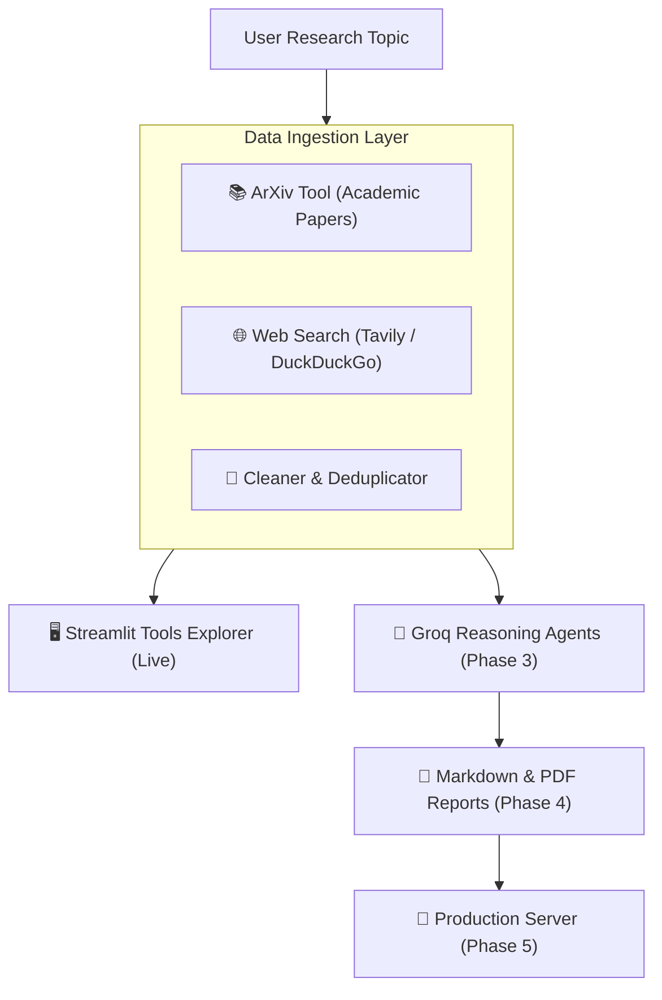

# 🔬 AI Research Assistant

A modular, checkpoint-driven AI Research Assistant that autonomously investigates academic literature, searches the web, and synthesizes structured research reports with citations.

---

## 🧭 Architecture



---

## ✨ Features (Completed So Far)

- **📚 Academic Paper Retrieval**: Direct integration with ArXiv to extract titles, authors, abstracts, dates, and direct PDF links.
- **🌐 Dual Web Search Engine**:
  - Primary: **Tavily Search API** (tailored for AI research agents).
  - Fallback: **DuckDuckGo Search** (100% free, zero-config automatic fallback).
- **🧹 Content Normalization & Deduplication**: Cleans boilerplate HTML, normalizes spacing, and eliminates duplicate sources.
- **🖥️ Interactive Streamlit UI**: Visual tool explorer running at `http://localhost:8501` to test searches live.
- **⚡ Blazing Fast Setup**: Powered by `uv` virtual environment and dependency management.

---

## 🚀 Quickstart Guide

### 1. Prerequisites
- Python 3.11+
- [`uv`](https://github.com/astral-sh/uv) (recommended) or standard `pip`

### 2. Environment Setup
```powershell
# Create virtual environment using uv
uv venv .venv

# Activate environment
.venv\Scripts\activate

# Install dependencies
uv pip install -r requirements.txt
```

### 3. Configure API Keys
Copy the template to `.env`:
```powershell
cp .env.example .env
```
Open [.env](.env) and add your keys:
```ini
# Primary LLM (Free tier: https://console.groq.com)
GROQ_API_KEY=your_groq_api_key_here
GROQ_MODEL=llama-3.3-70b-versatile

# Web Search (Free tier: https://tavily.com - optional, fallback is DuckDuckGo)
TAVILY_API_KEY=your_tavily_api_key_here
SEARCH_ENGINE=tavily
```

---

## 🖥️ Running the Streamlit Interface

Launch the interactive tools explorer:
```powershell
.venv\Scripts\streamlit run app.py
```
Open your browser at **`http://localhost:8501`**.

---

## 🧪 Testing & Verification

Run the automated test suite across all modules:
```powershell
# Run all unit and integration tests
.venv\Scripts\pytest -v

# Or run Phase 2 retrieval tool tests directly
.venv\Scripts\python -m tests.test_tools
```

---

## 📋 Project Structure

```text
research_assistant/
├── config/
│   └── settings.py         # Dynamic environment and settings loader
├── src/
│   ├── models/             # Pydantic data schemas (AcademicPaper, WebSearchResult, ResearchSource)
│   ├── tools/              # ArXiv, Web search (Tavily/DDG), and text cleaner
│   ├── agents/             # Query planner, synthesizer, orchestrator (Phase 3)
│   ├── utils/              # Logger, citation engine, multi-format exporter
│   └── server/             # API backend (Phase 5)
├── tests/                  # Automated pytest verification test suite
├── data/                   # Saved reports and cache
├── app.py                  # Streamlit visual explorer
├── .env.example            # Environment variables template
├── requirements.txt        # Project dependencies
├── plan.md                 # Master milestone roadmap with checkpoints
└── README.md               # Project documentation
```

---

## 🗺️ Roadmap & Checkpoints

Track our step-by-step development in [plan.md](plan.md):

- [x] **Phase 1: Project Setup & Environment** *(Checkpoint 1 Passed)*
- [x] **Phase 2: Research Tools & Streamlit Explorer** *(Checkpoint 2 Passed)*
- [ ] **Phase 3: Core LLM & Agentic Reasoning Workflow (Groq)**
- [ ] **Phase 4: Citation Engine & Multi-Format Exporter**
- [ ] **Phase 5: Production Server & Deployment Layer**
