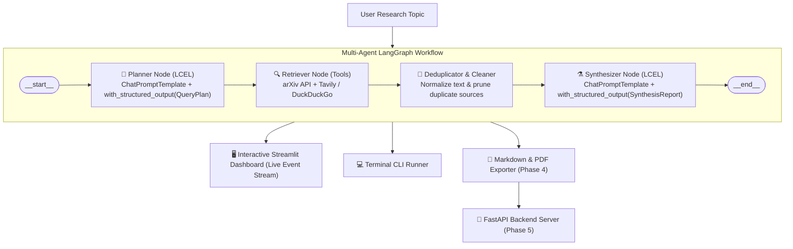

# 🔬 AI Research Assistant

An autonomous, multi-agent AI research assistant built with a **100% textbook LangChain & LangGraph** architecture. It decomposes broad research topics into targeted sub-questions, retrieves academic preprints from **arXiv** and real-time context from the **Web (Tavily / DuckDuckGo)**, normalizes and deduplicates the gathered sources, and synthesizes a comprehensive research report with inline citations.

---

## 🧭 System Architecture



---

## ✨ Features

- **🧠 Textbook LangChain & LangGraph Multi-Agent Architecture**:
  - State machine orchestrated via **LangGraph `StateGraph`** (`START ➔ planner ➔ retriever ➔ synthesizer ➔ END`).
  - Modular, versioned prompt templates in `src/prompts/`.
  - Reusable **LangChain Expression Language (LCEL)** chains with structured output binding in `src/chains/`.
  - Pure functional graph node transitions and streaming events in `src/graphs/`.
- **📋 Autonomous Query Decomposition**:
  - Breaks broad topics into 3–5 targeted research angles (foundations, architectures, challenges, applications).
  - Generates domain-specific search keywords and routes sub-queries to appropriate sources (`arxiv`, `web`, or `both`).
- **📚 Multi-Source Research Ingestion**:
  - **Academic Literature**: Direct integration with the **arXiv API** (titles, authors, abstracts, published dates, and PDF links) with resilient socket timeouts.
  - **Web Intelligence**: Primary integration with **Tavily Search API** (tailored for AI agents), with zero-config fallback to **DuckDuckGo Search**.
- **🧹 Content Normalization & Deduplication**:
  - Strips boilerplate HTML and whitespace noise.
  - Prunes duplicate sources based on normalized URLs and titles into a unified `ResearchSource` stream.
- **⚗️ Structured Synthesis with Source Citations**:
  - Synthesizes findings across multiple structured sections: *Key Findings*, *Technical Approaches*, *Consensus & Controversies*, *Research Gaps*, *Practical Applications*, and *Future Directions*.
  - Strictly maps claims to referenced sources using indexed citations (`[0]`, `[1]`, `[2]`).
- **🖥️ Dual-Mode Streamlit Dashboard (`app.py`)**:
  - **Mode 1 (Full Research)**: End-to-end LangGraph pipeline with real-time streaming progress callbacks, tabbed inspection of the synthesized report, decomposed query plan, and source cards.
  - **Mode 2 (Tools Explorer)**: Manual inspection interface to browse and test arXiv and Web search queries individually.
- **💻 CLI Runner**:
  - Execute full research cycles straight from the terminal with `python -m src.agents --topic "..."`.
- **🧪 Comprehensive Test Suite**:
  - 26 automated unit tests covering graph compilation, nodes, chains, and error recovery with 100% offline mocking.

---

## 🚀 Quickstart Guide

### 1. Prerequisites
- Python 3.11+
- [`uv`](https://github.com/astral-sh/uv) (recommended) or standard `pip`

### 2. Environment Setup
```powershell
# Create virtual environment using uv
uv venv .venv

# Activate environment (Windows)
.venv\Scripts\activate

# Install dependencies
uv pip install -r requirements.txt
```

### 3. Configure API Keys
Copy the environment template:
```powershell
cp .env.example .env
```
Open [.env](.env) and add your keys:
```ini
# Primary LLM (Free tier: https://console.groq.com)
GROQ_API_KEY=your_groq_api_key_here
GROQ_MODEL=llama-3.3-70b-versatile

# Web Search (Free tier: https://tavily.com - optional, fallback is DuckDuckGo)
TAVILY_API_KEY=your_tavily_api_key_here
SEARCH_ENGINE=tavily
```

---

## 🖥️ Running the Application

### Interactive Streamlit Dashboard
Launch the web interface:
```powershell
streamlit run app.py
```
Open your browser at **`http://localhost:8501`** (or the port shown in terminal).

### Command-Line Interface (CLI)
Run a full research run directly in your terminal:
```powershell
python -m src.agents --topic "Quantum Machine Learning" --papers 2 --web 2
```

---

## 🧪 Testing & Verification

Run the automated test suite across all modules:
```powershell
# Run the complete test suite (26 passing tests)
uv run pytest tests/test_graphs.py tests/test_agents.py tests/test_config.py -v

# Run fast tool normalization tests
uv run pytest tests/test_tools.py -k "not test_arxiv_search and not test_web_search"
```

---

## 📋 Project Directory Structure

```text
research_assistant/
├── config/                  # Configuration & pydantic environment loader
├── src/
│   ├── prompts/             # Textbook LangChain: Decoupled ChatPromptTemplates
│   │   ├── __init__.py
│   │   ├── planner.py       # Query decomposition prompt template
│   │   └── synthesizer.py   # Source synthesis prompt template
│   ├── chains/              # Textbook LangChain: Composable LCEL runnables
│   │   ├── __init__.py
│   │   ├── llm.py           # ChatGroq model factory
│   │   ├── planner.py       # LCEL chain: planner_prompt | llm.with_structured_output(QueryPlan)
│   │   └── synthesizer.py   # LCEL chain: synthesizer_prompt | llm.with_structured_output(SynthesisReport)
│   ├── graphs/              # Textbook LangGraph: Multi-agent StateGraph
│   │   ├── __init__.py
│   │   ├── state.py         # ResearchGraphState TypedDict schema
│   │   ├── nodes.py         # Graph nodes (plan_node, retrieve_node, synthesize_node)
│   │   └── graph.py         # StateGraph assembly, compilation, and streaming run_research()
│   ├── tools/               # Registered @tool definitions and retrieval engines
│   │   ├── arxiv_tool.py    # arXiv search with resilient socket timeout
│   │   ├── web_search_tool.py # Tavily + DuckDuckGo search
│   │   ├── text_cleaner.py  # Content normalization and deduplication
│   │   └── langchain_tools.py # LangChain @tool wrappers (arxiv_search, web_search)
│   ├── models/              # Pydantic schemas (QueryPlan, SynthesisSection, ResearchResult)
│   ├── utils/               # Structured logger
│   └── agents/              # Backward-compatibility facades delegating to chains & graphs
├── tests/
│   ├── test_graphs.py       # LangGraph state machine & node unit tests
│   ├── test_agents.py       # Backward-compatibility facade tests
│   ├── test_config.py       # Settings & environment validation tests
│   └── test_tools.py        # Tool normalization & retrieval tests
├── data/                    # Saved research reports and cache
├── app.py                   # Streamlit interactive dashboard
├── .env.example             # Environment variables template
├── requirements.txt         # Project dependencies
├── plan.md                  # Master milestone roadmap with checkpoints
└── README.md                # Project documentation
```

---

## 🗺️ Roadmap & Milestones

Track our step-by-step development in [plan.md](plan.md):

| Phase | Description | Status |
| :--- | :--- | :---: |
| **Phase 1** | Project Scaffolding & Environment Setup | 🟢 Completed |
| **Phase 2** | Research Tools (arXiv + Tavily/DDG) & Tools Explorer | 🟢 Completed |
| **Phase 3** | Core Reasoning Pipeline (LangChain LCEL & LangGraph StateGraph) | 🟢 Completed |
| **Phase 4** | Citation Engine, Fact-Checking & Multi-Format Exporter (PDF/MD) | 🟡 Next Up |
| **Phase 5** | Production Server (FastAPI), Async Workers & Dockerization | ⚪ Pending |

---

## 📄 License

This project is licensed under the [MIT License](LICENSE).
