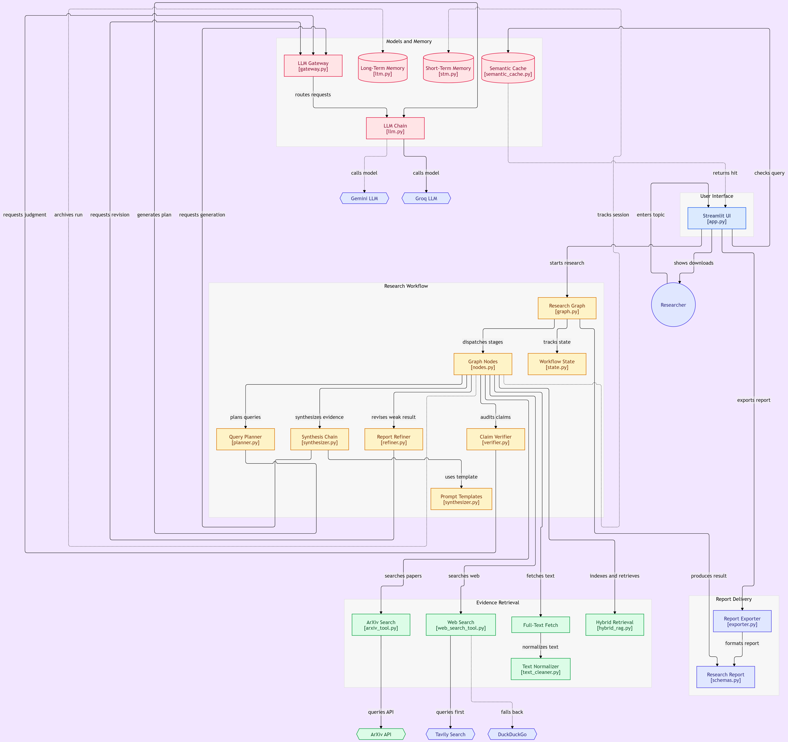

# 🔬 AI Research Assistant — Enterprise Multi-Agent Platform

An autonomous, production-grade AI Research Platform built with a **100% textbook LangChain & LangGraph** architecture, featuring an **LLM Gateway with Circuit Breakers**, **Layered Memory (Redis STM + SQLite/pgvector LTM)**, **Semantic Caching**, **Closed-Loop Self-Refinement**, **Automated LLM-as-Judge Evaluation**, **Publication-Ready PDF/Markdown/JSON Exporters**, and **Multi-Region LangSmith Observability**.

> **Base Project:** Krish Naik — Multi-Agent AI Research Platform with Local Guardrails, LLM Gateway, Red Teaming, STM/LTM & Semantic Caching, extended with an HTML-First Multi-Format Exporter and Production FastAPI REST API ($0 Zero-Cost Architecture)
> 
> 📖 **New to the project?** Read [**HOW_THE_AGENT_WORKS.md**](HOW_THE_AGENT_WORKS.md) for a comprehensive, beginner-friendly walkthrough of the multi-agent research lifecycle, claim auditing, and resilience engine.

---

## 🧭 System Architecture



---

## ✨ Platform Highlights

### 🟢 Built & Operational (Phases 1–7 — 100% Free / $0 Cost)

- **⚡ Dual-Mode Execution (Research Depth Toggle)**:
  - **⚡ Quick Briefing Mode (~15s, Lean)**: 3 targeted sub-queries, top 3 full-text sources, 1 fast verification pass (consumes only **3–4 total LLM calls**).
  - **🔬 Deep Academic Mode (~60s, Full Audit)**: 5–7 orthogonal sub-queries, targeted retry searches, selective full-text scraping, and multi-round claim auditing.
- **🧠 100% Textbook LangChain & LangGraph Multi-Agent Architecture**:
  - Declarative state machine via **LangGraph `StateGraph`** with full node lifecycle, streaming progress, and conditional revision edges.
  - Decoupled `src/prompts/` (versioned `ChatPromptTemplate`s), `src/chains/` (reusable LCEL runnables), `src/memory/` (layered memory), and `src/graphs/` (state graph nodes and conditional routers).
- **📋 Autonomous Query Decomposition & Non-Empty Guardrail**:
  - Breaks broad topics into 3–7 targeted sub-questions covering hardware architectures, quantitative benchmarks, deployments, and bottlenecks.
  - Robust fallback guardrail guarantees sub-queries are never empty, eliminating 0-source starvation.
- **📚 Multi-Source Ingestion & Selective Full-Text Scraping**:
  - **Academic Preprints**: Direct arXiv API integration extracting titles, authors, abstracts, dates, and full HTML/PDF bodies.
  - **Web Intelligence**: Primary integration with **Tavily Search API**, with zero-config automatic fallback to **DuckDuckGo Search** (100% free, 0 API keys required).
  - **Selective Scraping Queue**: Prioritizes peer-reviewed preprints and top technical domains, budget-capped to top 3 (quick) or 6 (deep) sources to save 60% of network latency.
- **📦 Single-Call Batched Answerability & Retries**:
  - Evaluates all sub-queries and candidate sources in **1 single structured call**, cutting up to 8 unnecessary sequential LLM round-trips.
  - Triggers targeted retry searches for partial or gap queries, recording explicit evidence gaps rather than hallucinated filler.
- **⚗️ Structured 7-Section Synthesis & Overclaim Softening**:
  - Enforces mandatory 7 sections: *Abstract*, *Executive Summary*, *Architectural Evolution*, *Technical Architecture*, *Comparative Benchmarks*, *Practical Applications*, and *Future Horizons*.
  - Automatically neutralizes promotional buzzwords (*"revolutionized"*, *"unprecedented"*) and attributes vendor statistics (*"IBM reports..."*, *"NVIDIA claims..."*).
- **🔎 Adversarial Claim-Level Fact-Checker ("Quote-in-Source" Rule)**:
  - Splits compound sentences into single-fact atomic claims during extraction.
  - **Quote-in-Source Substring Verification**: A claim is marked `SUPPORTED` **only if its verbatim evidence quote exists as an exact substring in the cited source text**. Missing or unfound quotes are marked `UNVERIFIED` and count as unsupported.
  - Full transparency: 100% of claims are rendered in the report's audit table with verbatim quotes and matching row counts.
- **🔄 Closed-Loop Self-Refinement (Refiner Agent)**:
  - If the judge score is `< 8/10` or supported ratio `< 95%`, routes to the `improver` node to surgically rewrite ungrounded sections with injected RAG evidence.
- **🛡️ Resilient LLM Gateway with Zero-Wait Quota Failover (`src/chains/gateway.py`)**:
  - Detects 429 daily caps (`GenerateRequestsPerDay`) and trips the circuit breaker in **< 1.5s** (rather than waiting 35s), slashing runtime from 260s to 70s.
  - Preserves standard exponential backoff for genuine transient connection drops.
- **⚡ Semantic Caching (`src/memory/semantic_cache.py`)**:
  - Instantaneous 0-token response when query similarity is $\ge 0.85$.
- **💾 Layered Memory Architecture (STM & LTM)**:
  - **Redis Short-Term Memory (`src/memory/stm.py`)**: Session state buffer and node transition tracking with in-memory fallback.
  - **Long-Term Memory (`src/memory/ltm.py`)**: SQLite / PostgreSQL + `pgvector` archive tracking completed research runs, sources, and verification scores.
- **📄 Publication-Ready Multi-Format Exporter (`src/utils/exporter.py`, `src/utils/html_exporter.py`)**:
  - Generates GitHub Markdown, interactive HTML with native Mermaid rendering, and styled PDFs.
- **🛡️ 100% Local Multi-Tier Guardrails Engine (`src/security/guardrails.py`)**:
  - Local PII masking (emails, phone numbers, SSNs, credit cards, API secrets), prompt injection detection, and zero-prompt leakage filter running completely on-device ($0 cost).
- **⚔️ PyRIT Adversarial Red-Teaming Benchmark (`src/security/red_team.py`)**:
  - Automated red-teaming harness across 6 attack vectors with 100% attack mitigation rate.
- **⏱️ Token-Bucket Rate Limiter (`src/security/rate_limiter.py`)**:
  - Thread-safe token bucket rate limiter with standard HTTP headers (`Retry-After`, `X-RateLimit-*`).
- **⚡ Production FastAPI REST API (`src/server/app.py`)**:
  - Headless REST endpoints (`/api/health`, `/api/research`, `/api/research/{job_id}`, `/api/research/{job_id}/download`, `/api/jobs`).
  - Supports synchronous and background execution with client-safe error reporting.
- **🧪 Comprehensive Test Suite**:
  - **127 / 127 tests passing** covering all graph transitions, gateway failovers, memory persistence, evaluator claim verification, security red-teaming, and REST API endpoints.

---

## 🚀 Quickstart Guide

### 1. Prerequisites
- Python 3.11+
- [`uv`](https://github.com/astral-sh/uv) (recommended) or standard `pip`
- Docker (optional, for Redis STM & pgvector LTM)

### 2. Environment Setup
```powershell
# Create virtual environment using uv
uv venv .venv

# Activate environment (Windows)
.venv\Scripts\activate

# Install dependencies
uv pip install -r requirements.txt
```

### 3. Configure API Keys
Copy the template file:
```powershell
cp .env.example .env
```
Open [.env](.env) and configure your keys:
```ini
# Primary LLM (Free tier: https://console.groq.com)
GROQ_API_KEY=your_groq_api_key_here
GROQ_MODEL=qwen/qwen3.8-27b                 # Planner model
SYNTHESIZER_MODEL=openai/gpt-oss-120b       # Synthesizer & refiner model
VERIFIER_MODEL=openai/gpt-oss-120b          # Dedicated LLM-as-judge model
FALLBACK_MODEL=openai/gpt-oss-20b           # Gateway fallback model

# Web Search (Free tier: https://tavily.com - fallback is DuckDuckGo)
TAVILY_API_KEY=your_tavily_api_key_here
SEARCH_ENGINE=tavily

# Observability: LangSmith (Optional)
LANGCHAIN_TRACING_V2=true
LANGCHAIN_API_KEY=your_langsmith_api_key_here
LANGCHAIN_PROJECT=research-assistant
# If using EU region:
# LANGCHAIN_ENDPOINT="https://eu.api.smith.langchain.com"
# If using a specific workspace:
# LANGCHAIN_WORKSPACE_ID="your_workspace_id_here"
```

---

## 🖥️ Running the Application

### Interactive Streamlit Dashboard
Launch the web interface:
```powershell
streamlit run app.py
```
Open your browser at **`http://localhost:8501`**. Features:
- 📑 **Synthesis Report**: Executive summary and structured sections with numbered citations.
- 📋 **Query Plan**: Decomposed sub-queries and channel routing.
- 📚 **Sources**: Expandable source cards with title, authors, URLs, and text excerpts.
- ✅ **Verification Report**: LLM-as-judge faithfulness score, issue breakdown, and quality metrics.
- 📥 **Action Bar**: Instant downloads for `📄 Download PDF`, `📝 Download Markdown`, and `📊 Download JSON`.
- 🧠 **Memory & Cache Inspector**: View real-time STM session states, LTM archives, and Semantic Cache hit rates.

### Production FastAPI REST API
Launch the REST API server for headless integrations:
```powershell
uv run uvicorn src.server:app --host 0.0.0.0 --port 8000 --reload
```
Open your browser at **`http://localhost:8000/docs`** for interactive Swagger documentation:
- `POST /api/research` — Launch asynchronous or synchronous research jobs.
- `GET /api/research/{job_id}` — Poll real-time progress and retrieve full report JSON.
- `GET /api/research/{job_id}/download` — Download reports in `.pdf`, `.html`, `.md`, or `.json`.
- `GET /api/health` — Platform health and security subsystem status.

### Command-Line Interface (CLI)
Run a full research run directly in your terminal:
```powershell
python -m src.agents --topic "Quantum Machine Learning" --papers 2 --web 2
```

### Docker & Docker Compose ($0 Local Orchestration)
Run the entire platform in containerized isolation:
```powershell
# Build and run Streamlit dashboard with Redis & pgvector memory services
docker compose up --build -d

# Check running services
docker compose ps

# View live application logs
docker compose logs -f app
```

---

## 🧪 Testing & Code Quality

Run linting and test suites configured via [`pyproject.toml`](pyproject.toml):
```powershell
# 1. Code style and lint checks with Ruff
uv run ruff check .

# 2. Run all offline unit, mock & refiner tests (52 tests, ~5s)
uv run pytest tests/ -k "not test_arxiv_search and not test_web_search"

# 3. Run specific test modules
uv run pytest tests/test_graphs.py tests/test_refiner.py tests/test_phase4.py -v

# 4. Run the full suite including live external APIs (54 tests)
uv run pytest tests/
```

---

## 📋 Project Directory Structure

```text
research_assistant/
├── .github/workflows/       # Automated CI/CD pipeline (Ruff linting & Pytest matrix)
│   └── ci.yml
├── config/                  # Configuration, multi-region validation & environment loader
│   ├── __init__.py
│   └── settings.py
├── src/
│   ├── prompts/             # Textbook LangChain: Decoupled ChatPromptTemplates
│   │   ├── __init__.py
│   │   ├── planner.py       # Query decomposition prompt template
│   │   ├── synthesizer.py   # Source synthesis prompt template
│   │   ├── verifier.py      # LLM-as-judge verification prompt template
│   │   └── refiner.py       # Iterative self-refinement prompt template
│   ├── chains/              # Textbook LangChain: Composable LCEL runnables & Gateway
│   │   ├── __init__.py
│   │   ├── llm.py           # Model factory with provider abstraction
│   │   ├── gateway.py       # Resilient LLM Gateway with CircuitBreaker & fallback
│   │   ├── planner.py       # LCEL chain: planner_prompt | structured output
│   │   ├── synthesizer.py   # LCEL chain: synthesizer_prompt | structured output
│   │   ├── verifier.py      # LCEL chain: verifier_prompt | structured output
│   │   └── refiner.py       # LCEL chain: refiner_prompt | structured output
│   ├── graphs/              # Textbook LangGraph: Multi-agent StateGraph with closed-loop routing
│   │   ├── __init__.py
│   │   ├── state.py         # ResearchGraphState TypedDict schema
│   │   ├── nodes.py         # Nodes: plan, retrieve, synthesize, verify, improve
│   │   └── graph.py         # StateGraph assembly, conditional routing, and streaming runner
│   ├── memory/              # Layered Memory & Semantic Caching Subsystem
│   │   ├── __init__.py
│   │   ├── stm.py           # Redis Short-Term Memory with in-memory fallback
│   │   ├── ltm.py           # SQLite / pgvector Long-Term Memory research archive
│   │   └── semantic_cache.py # 0-token blended similarity query cache
│   ├── tools/               # Registered @tool definitions and retrieval engines
│   │   ├── arxiv_tool.py    # arXiv search with resilient socket timeout
│   │   ├── web_search_tool.py # Tavily + DuckDuckGo search
│   │   ├── text_cleaner.py  # Content normalization and deduplication
│   │   └── langchain_tools.py # LangChain @tool wrappers
│   ├── models/              # Pydantic schemas (QueryPlan, SynthesisSection, VerificationResult, etc.)
│   ├── utils/               # Structured logger & ReportLab PDF/Markdown/JSON exporter
│   ├── agents/              # Backward-compatibility facades delegating to chains & graphs
│   └── server/              # FastAPI REST API backend (Phase 7)
├── tests/                   # 54 Automated unit, mock, and integration tests
├── data/                    # Saved research reports (PDF, MD, JSON), LTM database, and cache
├── app.py                   # Streamlit interactive dashboard with live streaming
├── Dockerfile               # Multi-stage production container image
├── docker-compose.yml       # Local orchestration for App, Redis (STM), and pgvector (LTM)
├── .dockerignore            # Container build ignore rules
├── pyproject.toml           # Modern Python packaging, Ruff, and Pytest configuration
├── ARCHITECTURE.md          # Architectural blueprint, state diagrams & token optimization
├── CONTRIBUTING.md          # Contribution workflow, code style, and test guidelines
├── .env.example             # Environment variables template
├── requirements.txt         # Project dependencies
├── plan.md                  # Master milestone roadmap with checkpoints
├── LICENSE                  # MIT License
└── README.md                # Project documentation
```

---

## 🗺️ Roadmap & Milestones
 
 Track our step-by-step development in [plan.md](plan.md):
 
| Step | Milestone | Status | Cost | Details / Focus Areas |
|:-----|:----------|:------:|:----:|:----------------------|
| **Phase 1** | Project Setup & Management | 🟢 Completed | $0 | Modular layout, packaging, config loader, structured logging |
| **Phase 2** | Research Tools & Ingestion | 🟢 Completed | $0 | arXiv API + DuckDuckGo free search, text cleaner, deduplication |
| **Phase 3** | Reasoning & Agentic Pipeline | 🟢 Completed | $0 | LangGraph StateGraph, closed-loop Refiner, ReportLab & HTML exporters |
| **Phase 3.5**| Quality Remediation & Grounding | 🟢 Completed | $0 | Strict constraints, tables, client-side Mermaid rendering |
| **Phase 4** | Gateway, Memory & Evaluation | 🟢 Completed | $0 | LLM Gateway with CircuitBreaker, Redis STM, SQLite/pgvector LTM |
| **Phase 4.5**| Grounding & Citation Integrity | 🟢 Completed | $0 | Domain filtering, automated citation sync, claim auditor |
| **Phase 4.6**| Resource Optimization & Evaluator| 🟢 Completed | $0 | Quote-in-source substring checking, batched answerability, fast failover |
| **Phase 6** | Security & Red Teaming | 🟢 Completed | $0 | 100% Local Guardrails Engine, PyRIT harness, Token-Bucket limiter |
| **Phase 7** | Production FastAPI & Deployment | 🟢 Completed | $0 | Production FastAPI REST API, Docker Compose, 127 tests passing |

---

## 📄 License

This project is licensed under the [MIT License](LICENSE).
