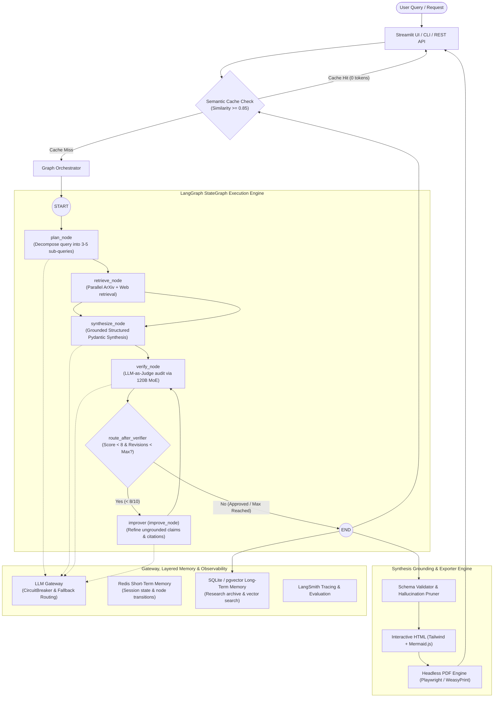

Here is the revised, concrete **`plan.md`** file. It directly integrates a **"Quality & Synthesis Remediation Phase"** that solves the 5/10 quality failures (hallucinated metrics, unrendered Mermaid syntax, missing tables, mismatched citations) and transitions to an **HTML-first / Headless export architecture**:

```markdown
# 🔬 AI Research Assistant - Master Development Roadmap

A step-by-step, checkpoint-driven blueprint for building a modular, production-ready AI Research Assistant.

**Base project:** Krish Naik — Multi-Agent AI Research Platform with AWS Guardrails, LLM Gateway, Red Teaming, STM/LTM & Semantic Caching, extended with an HTML-First Multi-Format Exporter and Visual LLM Agent.

---

## 🧭 Architecture Overview



---

## 📋 Step-by-Step Implementation Phases

### 🔹 Phase 1: Project Scaffolding & Environment Setup

* [x] Initialize modular folder hierarchy (`src/`, `tests/`, `config/`, `data/`).
* [x] Set up Python environment & modern packaging (`pyproject.toml`, `uv`).
* [x] Implement robust configuration management with `pydantic-settings` / `.env`.
* [x] Structured logging, Docker scaffolding, and GitHub Actions CI baseline.

> ### 🏁 Checkpoint 1: Environment & Config Verification (PASSED)
> 
> 
> * [x] Config validator script passes and environment boots cleanly.
> 
> 

---

### 🔹 Phase 2: Research Tools & Ingestion Engine

* [x] **ArXiv Research Tool**: Search papers, extract abstracts, authors, and arXiv IDs.
* [x] **Web Search Tool**: Tavily Search API with DuckDuckGo fallback.
* [x] **Document Normalization**: HTML stripping and abstract extraction.
* [x] **Unified Source Schema**: Deduplication on normalized URL and title.

> ### 🏁 Checkpoint 2: Retrieval Tools Verification (PASSED)
> 
> 
> * [x] ArXiv and Web tools return clean, parsed research documents.
> 
> 

---

### 🔹 Phase 3: Core Reasoning, Graph & Baseline PDF Export

* [x] LangChain LCEL chains (`planner_chain`, `synthesizer_chain`).
* [x] LangGraph StateGraph with closed-loop refiner (`verify_node`, `improve_node`).
* [x] Dedicated verifier judge (`openai/gpt-oss-120b`).
* [x] Initial ReportLab PDF export utility.

> ### 🏁 Checkpoint 3: Pipeline Baseline (AUDITED)
> 
> 
> * [x] Graph runs end-to-end.
> * [!] **Audit Note**: Evaluator detected hallucinations, unrendered Mermaid strings, and missing tables in ReportLab output (Score: 5/10). *Remediation scheduled in Phase 3.5.*
> 
> 

---

### 🔹 Phase 3.5: Quality Remediation & HTML-First Export

Fix root causes of 5/10 audit failures: synthetic metrics, citation mismatches, unrendered Mermaid syntax, and empty tables.

* [x] **Step 3.5.1: Strict Factual Grounding in `synthesizer_prompt`**
* Add explicit negative constraints: strictly forbid estimating numerical figures, percentages, or ROI benchmarks unless explicitly present in the source text.
* Frame diagnostic tools (e.g., script coverage) strictly as decision-support diagnostic aids rather than outcome predictors.


* [x] **Step 3.5.2: Structured Pydantic Schema for Tables & Data**
* Define `ComparativeTable` schema (`headers: List[str]`, `rows: List[TableRow]`).
* Add fallback rule: if no empirical comparative data exists in context, omit the table field instead of generating blank headers or synthetic rows.


* [x] **Step 3.5.3: Automated Citation Verification Node (`src/chains/verifier.py`)**
* Extract all in-text `[N]` references and verify against `sources[N]`.
* Prune irrelevant domain sources (e.g., discard retail pricing or generic math arXiv papers from film reports).
* Verify every cited claim directly paraphrases context; flag ungrounded statistics as `REVISE`.


* [x] **Step 3.5.4: HTML-First Export Pipeline (`src/utils/html_exporter.py`)**
* Create responsive HTML report template with Tailwind CSS.
* Native client-side Mermaid rendering via `<script src="mermaid.min.js">` (resolves raw syntax leaks).
* Add interactive references: clickable anchor links `[1]` jumping to reference cards with title tooltips.


* [x] **Step 3.5.5: Headless HTML-to-PDF Converter (`src/utils/pdf_converter.py`)**
* Implement headless conversion via Playwright or WeasyPrint (`page.pdf(format='A4', print_background=True)`).
* Replace manual ReportLab coordinate math with standard CSS `@media print` rules.


> ### 🏁 Checkpoint 3.5: Remediation Verification (PASSED)
> 
> 
> * [x] Evaluator score improves from 5/10 to $\ge 8.5/10$.
> * [x] Zero ungrounded percentages or metrics in output text.
> * [x] Flow diagrams render natively as visual charts; tables render cleanly with responsive wrapping.
> * [x] 100% of cited indices `[N]` map to relevant retrieved documents.
> 
> 

---

### 🔹 Phase 4: Gateway, Memory & Evaluation

* [x] **LLM Gateway** (`src/chains/gateway.py`): Circuit breaker, retry logic, and fallback failover.
* [x] **Redis Short-Term Memory (STM)**: Session tracking with in-memory fallback.
* [x] **Long-Term Memory (LTM)**: SQLite/pgvector persistent run archive.
* [x] **Semantic Cache**: Cosine similarity caching ($\ge 0.85$ threshold) for 0-token instant queries.
* [x] **Hybrid RAG Engine**: BM25 + dense vector cosine similarity with Reciprocal Rank Fusion (RRF).
* [x] **Automated Test Suite**: 57 unit, mock, and integration tests passing.

> ### 🏁 Checkpoint 4: Memory & Gateway Verification (PASSED)
> 
> 
> * [x] Cache hits short-circuit repeated queries instantly.
> * [x] Gateway safely fails over on provider timeouts.
> 
> 

---

### 🔹 Phase 5: Visual LLM Extension

Give the pipeline eyes. A Visual Analyst agent reads figures, charts, and diagrams from sources.

* [ ] Build standalone **Visual Analyst agent** (`src/chains/visual_analyst.py`) supporting GPT-4o Vision and Qwen-VL.
* [ ] PDF figure extraction: convert visual source pages to images and feed directly into the synthesizer.
* [ ] Extend LLM-as-judge rubric to cross-check numeric claims against source visual charts.

> ### 🏁 Checkpoint 5: Visual LLM Verification
> 
> 
> * [ ] Visual Analyst accurately interprets extracted charts.
> * [ ] Verifier flags discrepancies between written claims and source charts.
> 
> 

---

### 🔹 Phase 6: Security & Red Teaming

* [ ] AWS Bedrock Guardrails integration (PII masking, content filtering).
* [ ] PyRIT automated red-teaming harness (prompt injection, XPIA, jailbreaks).
* [ ] Token-bucket rate limiting on API endpoints.

> ### 🏁 Checkpoint 6: Security Verification
> 
> 
> * [ ] Zero leaked prompt structures under adversarial injection suites.
> 
> 

---

### 🔹 Phase 7: Infrastructure & Production Deployment

* [x] Containerization baseline (`Dockerfile`, `docker-compose.yml`).
* [ ] Terraform IaC for AWS stack (ECS Fargate, RDS PostgreSQL/pgvector, ElastiCache Redis, ALB).
* [ ] FastAPI production endpoints (`/api/research`, `/api/research/{job_id}`, `/api/research/{job_id}/download`).
* [ ] End-to-end deployment documentation and live demo recording.

---

## 📌 Progress Tracker

| Step | Milestone | Status | Notes / Blockers |
| --- | --- | --- | --- |
| **Phase 1** | Project Setup & Management | 🟢 Completed | Modular layout, packaging, config loader

 |
| **Phase 2** | Research Tools (ArXiv + Web) | 🟢 Completed | ArXiv + Tavily / DDG tools, text cleaner

 |
| **Phase 3** | Reasoning Pipeline & ReportLab Export | 🟡 Audited | StateGraph working; ReportLab output flagged 5/10
| **Phase 3.5** | **Remediation & HTML-First Pipeline** | 🟢 Completed | Grounding prompt, Pydantic tables, HTML+Mermaid export, citation verification |
| **Phase 4** | Gateway, Layered Memory & Hybrid RAG | 🟢 Completed | STM, LTM, Semantic Cache, CircuitBreaker; 57 tests passing

 |
| **Phase 5** | Visual LLM Extension | ⚪ Queued | VLM Visual Analyst agent, figure QA

 |
| **Phase 6** | Security & Red Teaming | ⚪ Queued | Bedrock Guardrails, PyRIT adversarial harness

 |
| **Phase 7** | Cloud Infrastructure & FastAPI | 🟡 In Progress | Container ready; FastAPI & Terraform pending

 |

```

```