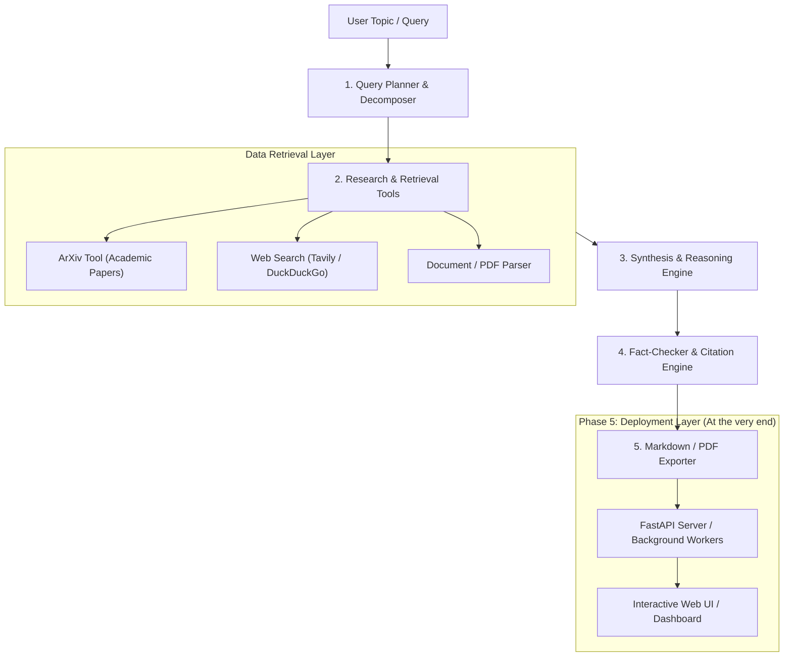

# 🔬 AI Research Assistant - Master Development Roadmap

A step-by-step, checkpoint-driven blueprint for building a modular, production-ready AI Research Assistant.

---

## 🧭 Architecture Overview



---

## 📋 Step-by-Step Implementation Phases

### 🔹 Phase 1: Project Scaffolding & Environment Setup
- [x] Initialize modular folder hierarchy:
  ```text
  research_assistant/
  ├── config/             # Configuration & environment loader
  ├── src/
  │   ├── tools/          # ArXiv, Web Search, Scrapers
  │   ├── agents/         # Planner, Researcher, Synthesizer
  │   ├── models/         # Pydantic schemas & state models
  │   ├── utils/          # Formatting, exports, logging
  │   └── server/         # API / Web server (Phase 5)
  ├── tests/              # Unit & integration tests
  ├── data/               # Cache, saved reports, downloads
  ├── .env.example        # Template for API keys
  ├── requirements.txt    # Project dependencies
  └── plan.md             # This progress tracker
  ```
- [x] Set up Python environment & dependency management (`uv` or `pip`).
- [x] Implement robust configuration management with `pydantic-settings` / `python-dotenv`.
- [x] Set up structured logging for research tracking.

> ### 🏁 Checkpoint 1: Environment & Config Verification
> - [x] Config validator script passes: successfully loads API keys or warns with actionable messages.
> - [x] Project directory structure is cleanly initialized without errors.

---

### 🔹 Phase 2: Research Tools & Ingestion Engine
- [ ] **ArXiv Research Tool**:
  - [ ] Search papers by topic, title, or authors.
  - [ ] Extract metadata: abstract, publication date, authors, PDF links, arXiv ID.
- [ ] **Web Search Tool**:
  - [ ] Integrate Tavily Search API or DuckDuckGo Search for general web & news context.
  - [ ] Clean and strip boilerplate HTML content.
- [ ] **Document & PDF Parsing**:
  - [ ] Implement text chunking and abstract extraction from downloaded academic papers.
- [ ] **Deduplication & Re-ranking**:
  - [ ] Score and deduplicate gathered literature based on relevance.

> ### 🏁 Checkpoint 2: Retrieval Tools Verification
> - [ ] Independent test scripts verify ArXiv query returns parsed paper objects.
> - [ ] Web search tool returns clean text snippets and source URLs.
> - [ ] Mock queries confirm zero crashes on network failures or malformed responses.

---

### 🔹 Phase 3: Core LLM & Agentic Reasoning Workflow
- [ ] Configure LLM provider abstraction (Groq, OpenAI, Google Gemini, or Ollama for local LLMs).
- [ ] **Query Decomposition & Planning Agent**:
  - [ ] Break down broad user queries into targeted sub-questions.
  - [ ] Formulate domain-specific search keywords.
- [ ] **Research Synthesis Agent**:
  - [ ] Process retrieved sources and summarize key insights.
  - [ ] Identify consensus, controversies, and research gaps.
- [ ] **State & Flow Orchestration**:
  - [ ] Implement state management (LangGraph or modular Python pipeline).
  - [ ] Enable iterative query refinement if initial results are insufficient.

> ### 🏁 Checkpoint 3: CLI Research Run Verification
> - [ ] Run full research cycle via CLI: `python -m src.agents.orchestrator --topic "Quantum Computing in Drug Discovery"`.
> - [ ] Outputs structured research notes with raw source citations directly to terminal.

---

### 🔹 Phase 4: Citation Engine, Fact-Checking & Report Generation
- [ ] **Citation & Attribution Engine**:
  - [ ] Standardize citation format (APA, IEEE, or Markdown with footnotes).
  - [ ] Validate every claim maps to an extracted source link.
- [ ] **Quality & Hallucination Guard**:
  - [ ] Cross-check generated report against retrieved excerpts.
- [ ] **Multi-Format Report Exporter**:
  - [ ] Export comprehensive research report to Markdown (`.md`).
  - [ ] Export to formatted PDF and JSON summaries.

> ### 🏁 Checkpoint 4: Report Quality & Export Verification
> - [ ] Automated verification: Report contains executive summary, literature review, findings, and bibliography.
> - [ ] Output file saved successfully in `data/reports/` with working citation links.

---

### 🔹 Phase 5: Server & Interactive Interface (Final Phase)
- [ ] **Backend API (FastAPI)**:
  - [ ] `POST /api/research`: Trigger async research job with topic & depth options.
  - [ ] `GET /api/research/{job_id}`: Stream progress / check status.
  - [ ] `GET /api/research/{job_id}/download`: Download report as PDF/Markdown.
- [ ] **Interactive User Interface**:
  - [ ] Streamlit Dashboard or Modern Web Frontend.
  - [ ] Real-time progress updates (showing current agent activity: Searching, Synthesizing, Exporting).
  - [ ] Interactive report viewer with markdown rendering and download buttons.
- [ ] **Production Readiness**:
  - [ ] Dockerfile containerization.
  - [ ] Caching layer to avoid repeated API spend on identical queries.

> ### 🏁 Checkpoint 5: Full System End-to-End Verification
> - [ ] Server starts with `python -m src.server.main` without warnings.
> - [ ] User can enter research prompt in UI/API, view real-time research progress, and download the finished report.

---

## 📌 Progress Tracker
 
| Step | Milestone | Status | Notes / Blockers |
| :--- | :--- | :---: | :--- |
| **Step 1** | Project Setup & Environment | 🟢 Completed | Directory scaffold, config loader & tests pass |
| **Step 2** | Research Tools (ArXiv + Web) | 🟡 Next Up | Tools implementation (ArXiv + Web Search) |
| **Step 3** | Reasoning & Agentic Pipeline | ⚪ Not Started | LLM integration & prompt design |
| **Step 4** | Citations & Report Exporter | ⚪ Not Started | Formatted Markdown & PDF output |
| **Step 5** | Server & Web Interface | ⚪ Not Started | FastAPI / Streamlit at the end |

