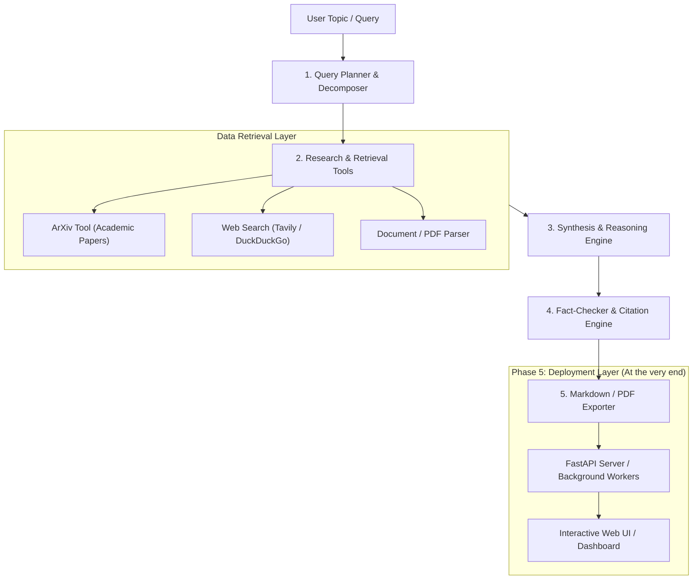

# 🔬 AI Research Assistant - Master Development Roadmap

A step-by-step, checkpoint-driven blueprint for building a modular, production-ready AI Research Assistant.

---

## 🧭 Architecture Overview



---

## 📋 Step-by-Step Implementation Phases

### 🔹 Phase 1: Project Scaffolding & Environment Setup
- [x] Initialize modular folder hierarchy:
  ```text
  research_assistant/
  ├── config/             # Configuration & environment loader
  ├── src/
  │   ├── tools/          # ArXiv, Web Search, Scrapers
  │   ├── agents/         # Planner, Researcher, Synthesizer
  │   ├── models/         # Pydantic schemas & state models
  │   ├── utils/          # Formatting, exports, logging
  │   └── server/         # API / Web server (Phase 5)
  ├── tests/              # Unit & integration tests
  ├── data/               # Cache, saved reports, downloads
  ├── .env.example        # Template for API keys
  ├── .env                # Local keys (Groq & Tavily)
  ├── .gitignore          # Environment & secret exclusion
  ├── requirements.txt    # Project dependencies
  ├── README.md           # Project documentation
  └── plan.md             # This progress tracker
  ```
- [x] Set up Python environment & dependency management (`uv` with `.venv`).
- [x] Implement robust configuration management with `pydantic-settings` / `python-dotenv`.
- [x] Set up structured logging for research tracking.

> ### 🏁 Checkpoint 1: Environment & Config Verification
> - [x] Config validator script passes: successfully loads API keys or warns with actionable messages.
> - [x] Project directory structure is cleanly initialized without errors.

---

### 🔹 Phase 2: Research Tools & Ingestion Engine
- [x] **ArXiv Research Tool**:
  - [x] Search papers by topic, title, or authors.
  - [x] Extract metadata: abstract, publication date, authors, PDF links, arXiv ID.
- [x] **Web Search Tool**:
  - [x] Integrate Tavily Search API or DuckDuckGo Search for general web & news context.
  - [x] Clean and strip boilerplate HTML content.
- [x] **Document & Content Normalization**:
  - [x] Implement text cleaning and abstract extraction from academic sources.
- [x] **Deduplication & Unified Schemas**:
  - [x] Unified `ResearchSource` model and duplicate pruning based on URL and title.
- [x] **Interactive Streamlit Explorer (`app.py`)**:
  - [x] Visual UI to search, browse, and inspect ArXiv & Web retrieval items live.

> ### 🏁 Checkpoint 2: Retrieval Tools Verification (PASSED)
> - [x] Independent test scripts verify ArXiv query returns parsed paper objects.
> - [x] Web search tool returns clean text snippets and source URLs.
> - [x] Mock queries confirm zero crashes on network failures or malformed responses.

---

### 🔹 Phase 3: Core LLM & Agentic Reasoning Workflow
- [x] Configure LLM provider abstraction (Groq via `llm_client.py`, extensible to OpenAI/Gemini).
- [x] **Query Decomposition & Planning Agent**:
  - [x] Break down broad user queries into targeted sub-questions.
  - [x] Formulate domain-specific search keywords.
- [x] **Research Synthesis Agent**:
  - [x] Process retrieved sources and summarize key insights.
  - [x] Identify consensus, controversies, and research gaps.
- [x] **State & Flow Orchestration**:
  - [x] Implement state management (dataclass-based modular Python pipeline).
  - [x] Enable iterative query refinement if initial results are insufficient.

> ### 🏁 Checkpoint 3: CLI Research Run Verification
> - [x] Run full research cycle via CLI: `python -m src.agents --topic "Quantum Computing in Drug Discovery"`.
> - [x] Outputs structured research notes with raw source citations directly to terminal.

---

### 🔹 Phase 4: Citation Engine, Fact-Checking & Report Generation
- [ ] **Citation & Attribution Engine**:
  - [ ] Standardize citation format (APA, IEEE, or Markdown with footnotes).
  - [ ] Validate every claim maps to an extracted source link.
- [ ] **Quality & Hallucination Guard**:
  - [ ] Cross-check generated report against retrieved excerpts.
- [ ] **Multi-Format Report Exporter**:
  - [ ] Export comprehensive research report to Markdown (`.md`).
  - [ ] Export to formatted PDF and JSON summaries.

> ### 🏁 Checkpoint 4: Report Quality & Export Verification
> - [ ] Automated verification: Report contains executive summary, literature review, findings, and bibliography.
> - [ ] Output file saved successfully in `data/reports/` with working citation links.

---

### 🔹 Phase 5: Server & Interactive Interface (Final Phase)
- [ ] **Backend API (FastAPI)**:
  - [ ] `POST /api/research`: Trigger async research job with topic & depth options.
  - [ ] `GET /api/research/{job_id}`: Stream progress / check status.
  - [ ] `GET /api/research/{job_id}/download`: Download report as PDF/Markdown.
- [ ] **Interactive User Interface**:
  - [ ] Streamlit Dashboard or Modern Web Frontend.
  - [ ] Real-time progress updates (showing current agent activity: Searching, Synthesizing, Exporting).
  - [ ] Interactive report viewer with markdown rendering and download buttons.
- [ ] **Production Readiness**:
  - [ ] Dockerfile containerization.
  - [ ] Caching layer to avoid repeated API spend on identical queries.

> ### 🏁 Checkpoint 5: Full System End-to-End Verification
> - [ ] Server starts with `python -m src.server.main` without warnings.
> - [ ] User can enter research prompt in UI/API, view real-time research progress, and download the finished report.

---

## 📌 Progress Tracker
 
| Step | Milestone | Status | Notes / Blockers |
| :--- | :--- | :---: | :--- |
| **Step 1** | Project Setup & Environment | 🟢 Completed | Directory scaffold, config loader & tests pass |
| **Step 2** | Research Tools (ArXiv + Web) | 🟢 Completed | ArXiv + Tavily / DDG tools & tests pass (5/5) |
| **Step 3** | Reasoning & Agentic Pipeline | 🟢 Completed | Groq LLM client, Planner, Synthesizer, Orchestrator & CLI |
| **Step 4** | Citations & Report Exporter | ⚪ Not Started | Formatted Markdown & PDF output |
| **Step 5** | Server & Web Interface | ⚪ Not Started | FastAPI / Streamlit at the end |


