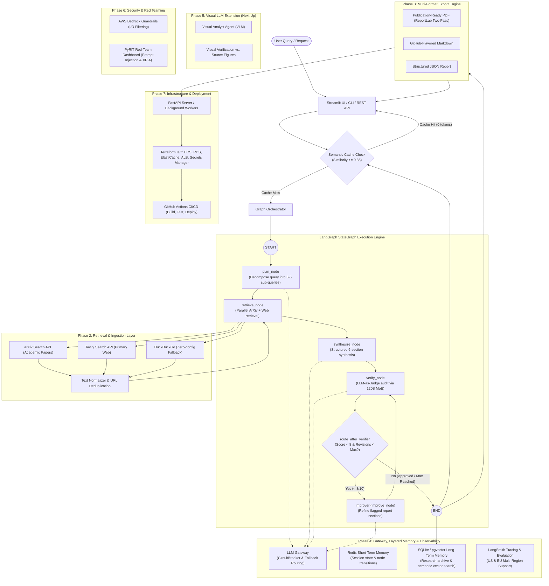

# 🔬 AI Research Assistant - Master Development Roadmap

A step-by-step, checkpoint-driven blueprint for building a modular, production-ready AI Research Assistant.

**Base project:** Krish Naik — Multi-Agent AI Research Platform with AWS Guardrails, LLM Gateway, Red Teaming, STM/LTM & Semantic Caching, extended with a Visual LLM agent

---

## 🧭 Architecture Overview



### 🏛️ Subsystem Architecture & Responsibilities

| Layer | Subsystem | Components / Technologies | Primary Responsibility |
| :--- | :--- | :--- | :--- |
| **Reasoning Core** | Multi-Agent StateGraph | LangGraph, LangChain LCEL, Pydantic | Orchestrates `plan_node`, `retrieve_node`, `synthesize_node`, `verify_node`, and `improve_node`. |
| **Evaluation Loop** | Closed-Loop Self-Correction | `src/chains/refiner.py`, `route_after_verifier` | Automatically iterates on reports scoring $<8/10$ until approved or revision limit is reached. |
| **Resilience** | LLM Gateway | `src/chains/gateway.py`, CircuitBreaker | Manages retries, provider failure thresholds, cooldowns, and automatic failover to fallback models. |
| **Ingestion** | Multi-Channel Retrieval | ArXiv API, Tavily API, DuckDuckGo, Text Cleaner | Parallel paper & web queries, HTML stripping, metadata extraction, and URL/title deduplication. |
| **Memory & Cache** | Layered Memory Hierarchy | Redis (STM), SQLite/pgvector (LTM), Semantic Cache | 0-token instant cache hits ($\ge 0.85$ similarity), session tracking, and cross-session knowledge archive. |
| **Observability** | Multi-Region Tracing | LangSmith (`@traceable`), Settings Validator | End-to-end trace collection across US (`api.smith`) and EU (`eu.api.smith`) endpoints with auto-disable safety. |
| **Presentation** | Multi-Format Export | ReportLab, Jinja/Markdown, Streamlit UI | Publication-ready two-pass PDF, Markdown, JSON export, and responsive 4-tab interactive web UI. |

### 🤖 Multi-Tier Model Strategy

| Agent / Role | Env Variable | Default Model | Architecture & Rationale |
| :--- | :--- | :--- | :--- |
| **Planner & Synthesizer** | `GROQ_MODEL` | `llama-3.3-70b-versatile` | High throughput (~300 tok/s), strong structural Pydantic schema adherence. |
| **Verifier (LLM-as-Judge)** | `VERIFIER_MODEL` | `openai/gpt-oss-120b` | 120B MoE model (131K context). Independent evaluation model avoids self-synthesis bias. |
| **Gateway Fallback** | `FALLBACK_MODEL` | `llama-3.1-8b-instant` | Lightweight ultra-fast model guaranteeing high-availability uptime during provider outages. |

---

## 📋 Step-by-Step Implementation Phases

### 🔹 Phase 1: Project Scaffolding & Environment Setup
- [x] Initialize modular folder hierarchy:
```text
research_assistant/
├── .github/workflows/  # Automated GitHub Actions CI pipeline (Ruff + Pytest matrix)
│   └── ci.yml
├── config/             # Environment loader & multi-region validation
├── src/
│   ├── prompts/        # Versioned ChatPromptTemplates (Planner, Synthesizer, Verifier, Refiner)
│   ├── chains/         # Composable LCEL chains (LLM Gateway, Planner, Synthesizer, Verifier, Refiner)
│   ├── graphs/         # LangGraph StateGraph, nodes, closed-loop router, and workflow execution
│   ├── tools/          # ArXiv, Web Search (Tavily/DDG), text cleaner, @tool wrappers
│   ├── memory/         # Redis STM, SQLite/pgvector LTM, Semantic Cache
│   ├── models/         # Pydantic schemas & state models
│   ├── utils/          # ReportLab PDF, Markdown, JSON exporters, structured logger
│   ├── agents/         # Backward-compatibility facades delegating to chains & graphs
│   └── server/         # API / Web server (Phase 7)
├── tests/              # 54 Automated unit, mock, and integration tests
├── data/               # Cache, saved reports (PDF/MD/JSON), LTM database
├── app.py              # Streamlit interactive dashboard with live streaming & memory inspect
├── Dockerfile          # Multi-stage production container image
├── docker-compose.yml  # Multi-service stack (App, Redis STM, PostgreSQL+pgvector LTM)
├── .dockerignore       # Docker build exclusion rules
├── pyproject.toml      # Modern Python packaging, Ruff, and Pytest configuration
├── ARCHITECTURE.md     # Architectural blueprint & Mermaid state machine
├── CONTRIBUTING.md     # Contributor guide, code standards, and PR checklist
├── .env.example        # Template for API keys
├── .env                # Local configuration (Groq, Tavily, LangSmith)
├── .gitignore          # Environment & secret exclusion
├── requirements.txt    # Project dependencies
├── README.md           # Master documentation
└── plan.md             # This progress tracker
```
- [x] Set up Python environment & dependency management (`uv` with `.venv` and `pyproject.toml`).
- [x] Implement robust configuration management with `pydantic-settings` / `python-dotenv`.
- [x] Set up structured logging for research tracking.
- [x] Create developer ergonomics & management docs (`ARCHITECTURE.md`, `CONTRIBUTING.md`, `pyproject.toml`).
- [x] Scaffolding for Docker containerization (`Dockerfile`, `docker-compose.yml`, `.dockerignore`) and CI/CD (`.github/workflows/ci.yml`).

> ### 🏁 Checkpoint 1: Environment & Config Verification (PASSED)
> - [x] Config validator script passes: successfully loads API keys or warns with actionable messages.
> - [x] Project directory structure is cleanly initialized without errors.
> - [x] Modern development tooling, CI pipeline, and architecture documentation active.

---

### 🔹 Phase 2: Research Tools & Ingestion Engine
- [x] **ArXiv Research Tool**: search by topic/title/author; extract abstract, date, authors, PDF links, arXiv ID; resilient socket timeouts.
- [x] **Web Search Tool**: Tavily Search API primary, zero-config fallback to DuckDuckGo Search.
- [x] **Document & Content Normalization**: text cleaning and abstract extraction from academic sources.
- [x] **Deduplication & Unified Schemas**: unified `ResearchSource` model, dedup on normalized URL/title.
- [x] **Interactive Streamlit Explorer (`app.py`)**: manual browse/test of ArXiv & Web retrieval.

> ### 🏁 Checkpoint 2: Retrieval Tools Verification (PASSED)
> - [x] Independent test scripts verify ArXiv query returns parsed paper objects.
> - [x] Web search tool returns clean text snippets and source URLs.
> - [x] Mock queries confirm zero crashes on network failures or malformed responses.

---

### 🔹 Phase 3: Core LLM & Agentic Reasoning Workflow (Textbook LangChain & LangGraph)
- [x] Configure LLM provider abstraction via **LangChain** (`langchain-groq`, `ChatGroq`, extensible to OpenAI/Gemini/GPT-4o).
- [x] **Modular Prompts Layer (`src/prompts/`)**: versioned `ChatPromptTemplate` for query decomposition and source synthesis.
- [x] **Composable LCEL Chains Layer (`src/chains/`)**: `planner_chain`, `synthesizer_chain` with structured output binding.
- [x] **State Machine Graph Layer (`src/graphs/`)**: `ResearchGraphState`, nodes `plan_node`, `retrieve_node`, `synthesize_node`, `verify_node`, `improve_node`, with closed-loop conditional routing (`route_after_verifier`).
- [x] **Dedicated Verifier LLM** (`openai/gpt-oss-120b` via Groq): the Verify node uses a separate, more capable judge model configured via `VERIFIER_MODEL` in `.env`.
- [x] **Closed-Loop Refinement (`src/chains/refiner.py`)**: If judge score < 8/10 and max revisions not reached, the `improver` node iteratively rewrites flagged sections and feeds back to `verifier`.
- [x] **Multi-Format Report Exporter (`src/utils/exporter.py`)**: Export verified research results into publication-ready PDF (ReportLab with custom typography, headers, citation tables, evaluator badges, and dynamic two-pass page numbering), GitHub-Flavored Markdown, and structured JSON. Includes auto-saving to `data/reports/`.
- [x] **Streamlit UI Download Action Bar**: One-click download buttons for `📄 Download PDF`, `📝 Download Markdown`, and `📊 Download JSON`, with auto-save confirmation and rerender caching.

> ### 🏁 Checkpoint 3: CLI, Web Research Run & PDF Export Verification (PASSED)
> - [x] CLI execution verified: `python -m src.agents --topic "Quantum Machine Learning"`.
> - [x] LangGraph StateGraph pipeline verified: Decomposes queries, retrieves sources, synthesizes sections, and self-corrects via verification loop.
> - [x] Verifier uses `openai/gpt-oss-120b` (120B MoE, 131K context window) as a dedicated judge model.
> - [x] Multi-format export verified: instantaneous PDF/MD/JSON downloads in Streamlit and auto-save to `data/reports/`.

---

### 🔹 Phase 4: Gateway, Memory & Evaluation
- [x] **LLM Gateway** (`src/chains/gateway.py`) — Resilient model routing with exponential retries, circuit breaker (failure tracking & cooldown), and automatic fallback model failover.
- [x] **Redis Short-Term Memory (STM)** (`src/memory/stm.py`) — Session state, node transition tracking, TTL expiry, with seamless in-memory fallback.
- [x] **Long-Term Memory (LTM)** (`src/memory/ltm.py`) — Persistent SQLite/pgvector archive tracking research runs, synthesis summaries, sources, and verification scores.
- [x] **Hybrid RAG Engine** (`src/tools/hybrid_rag.py`) — Multi-stage RAG integrating BM25 sparse keyword search and dense vector cosine similarity with Reciprocal Rank Fusion (RRF) across `synthesize_node`, `verify_node`, and `improve_node`.
- [x] **Complete Test Suite** — **57 unit, mock, and integration tests passing** across all modules.

> ### 🏁 Checkpoint 4: Gateway, Memory & Evaluation Verification (PASSED)
> - [x] Gateway fails over automatically with CircuitBreaker when primary provider errors or times out.
> - [x] STM persists session state; LTM archives completed research runs and supports history queries.
> - [x] Semantic cache correctly short-circuits near-duplicate queries (>0.85 similarity) with zero token spend.
> - [x] Hybrid RAG chunks sources and ranks evidence passages via BM25 + Vector RRF.
> - [x] 57/57 automated tests passing in CI/CD pipeline.
> - [x] Semantic cache correctly short-circuits near-duplicate queries (>0.85 similarity) with zero token spend.
> - [x] LangSmith health check and trace logging support custom & EU endpoints.
> - [x] 54/54 automated tests passing in CI/CD pipeline.

---

### 🔹 Phase 5: Visual LLM Extension (🎯 Next Up)
Give the pipeline eyes. A Visual Analyst agent reads figures, charts, and screenshots from source material instead of treating everything as text.

- [ ] Select and configure VLM provider (GPT-4o Vision or open-source Qwen-VL / LLaVA) and build standalone **Visual Analyst agent** (`src/chains/visual_analyst.py`).
- [ ] Wire Visual Analyst into the pipeline: convert PDF pages/figures from arXiv sources into images, route visually-rich sections to VLM, and merge visual findings into the Synthesizer.
- [ ] Add **visual verification step**: Extend the LLM-as-judge rubric to cross-check numeric/factual claims in the written report against actual source figures.

> ### 🏁 Checkpoint 5: Visual LLM Verification
> - [ ] Visual Analyst agent correctly answers a structured visual QA prompt on a standalone test image.
> - [ ] Pipeline correctly identifies which source pages are visual and routes them to the VLM.
> - [ ] Verify agent flags mismatched numeric claims against a source figure in test runs.

---

### 🔹 Phase 6: Security & Red Teaming
Prove the guardrails hold against adversarial attacks.

- [ ] Add **AWS Bedrock Guardrails** for input/output filtering, sensitive data masking, and rate limiting (sliding window / token bucket).
- [ ] Stand up a **PyRIT red-team dashboard** running jailbreak, XPIA (cross-prompt injection), crescendo, and skeleton-key attacks — including adversarial prompts hidden inside images.

> ### 🏁 Checkpoint 6: Guardrail & Red-Team Verification
> - [ ] Guardrails block documented prompt-injection and jailbreak test vectors.
> - [ ] Red-team dashboard reports pass/fail across text and visual attack classes.
> - [ ] Rate limiting and API auth verified against over-limit requests.

---

### 🔹 Phase 7: Infrastructure & Deployment
Ship as an enterprise platform with infrastructure as code, REST API, and production orchestration.

- [x] **Containerization Baseline**: Production multi-stage `Dockerfile`, `docker-compose.yml` (App, Redis STM, PostgreSQL+pgvector LTM), and `.dockerignore`.
- [x] **GitHub Actions CI/CD Baseline**: Automated linting (`ruff`) and multi-version Python test runner (`.github/workflows/ci.yml`).
- [ ] **Terraform**: Provision the AWS stack — ECS Fargate, RDS (PostgreSQL/pgvector), ElastiCache (Redis), ALB, Secrets Manager, ECR, VPC.
- [ ] **Backend API (FastAPI)**:
  - [ ] `POST /api/research`: Trigger async research job with topic & depth options.
  - [ ] `GET /api/research/{job_id}`: Stream progress / check status.
  - [ ] `GET /api/research/{job_id}/download`: Download report as PDF/Markdown/JSON.
- [ ] End-to-end deployment testing, demo recording, and production docs.

> ### 🏁 Checkpoint 7: Full System End-to-End Verification
> - [ ] FastAPI server starts with `python -m src.server.main` cleanly.
> - [ ] User can trigger research via UI/API, view live progress, and download finished reports.
> - [ ] Terraform provisions AWS infrastructure cleanly with automated CI/CD deployment.

---

## 📌 Progress Tracker

| Step | Milestone | Status | Notes / Blockers |
|:-----|:----------|:------:|:-----------------|
| **Phase 1** | Project Setup & Management | 🟢 Completed | Modular layout, `pyproject.toml`, `ARCHITECTURE.md`, `CONTRIBUTING.md`, config loader |
| **Phase 2** | Research Tools (ArXiv + Web) | 🟢 Completed | ArXiv + Tavily / DDG tools, text cleaner, source deduplication |
| **Phase 3** | Reasoning & Agentic Pipeline + PDF Exporter | 🟢 Completed | LangGraph StateGraph, closed-loop Refiner, dedicated Verifier judge (`openai/gpt-oss-120b`), ReportLab PDF/MD/JSON exporter |
| **Phase 4** | Gateway, Memory & Evaluation | 🟢 Completed | Resilient LLM gateway w/ CircuitBreaker, Redis STM, SQLite/pgvector LTM, Semantic Caching, LangSmith (US/EU); **54/54 tests passing** |
| **Phase 5** | Visual LLM Extension | 🎯 Next Up | VLM Visual Analyst agent, multimodal RAG wiring, visual figure verification |
| **Phase 6** | Security & Red Teaming | ⚪ Pending | AWS Bedrock Guardrails, PyRIT red-team dashboard incl. multimodal attacks |
| **Phase 7** | Infrastructure & Deployment | 🟡 In Progress | Dockerfile, docker-compose.yml, GitHub Actions CI active; FastAPI & Terraform pending |